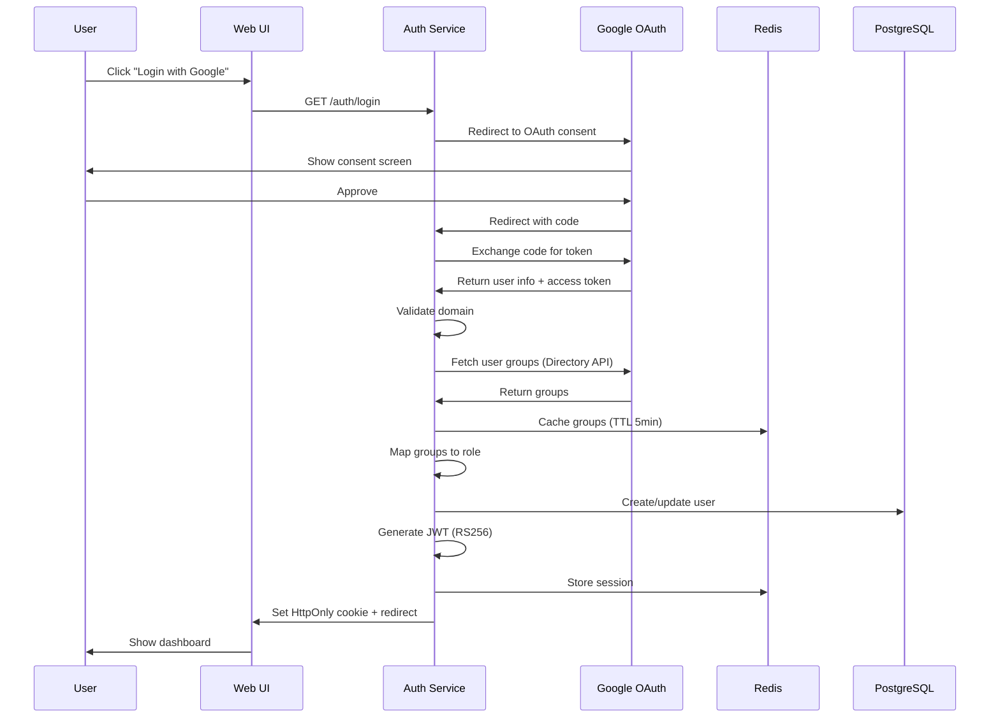
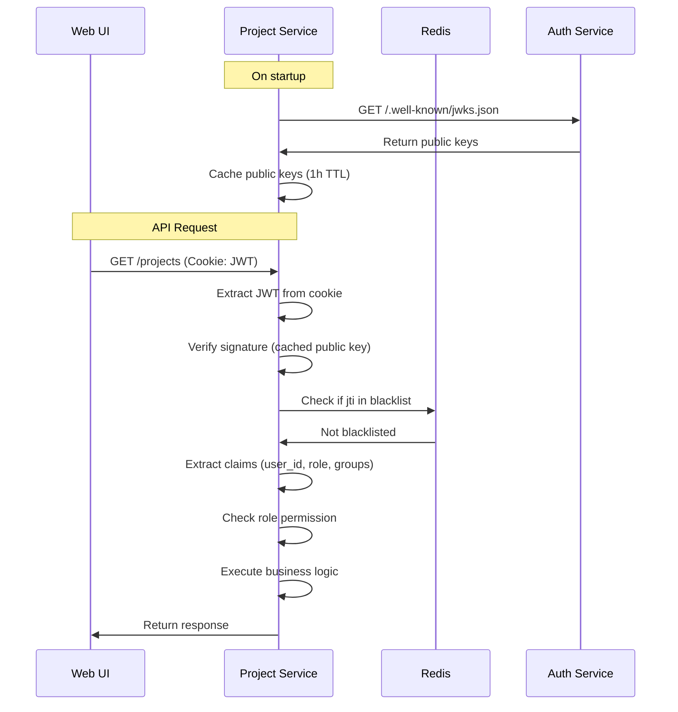
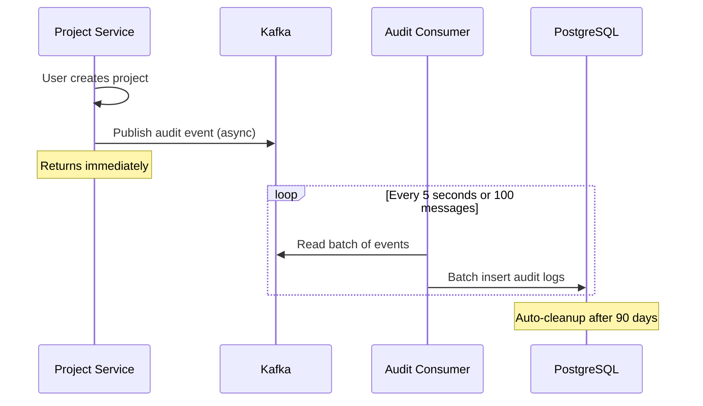

# Design Document: Auth Service Migration

## Overview

The Auth Service is a greenfield implementation replacing the Identity Service to support on-premise enterprise deployments. It provides Single Sign-On (SSO) authentication via Google OAuth2/OIDC, role-based access control through Google Groups mapping, JWT-based authorization with asymmetric keys, and comprehensive audit logging for compliance.

### Key Design Principles

1. **Enterprise-First**: Designed for single-tenant on-premise deployments with enterprise SSO integration
2. **Self-Validation**: Services verify JWT tokens independently using public keys (no central auth calls)
3. **Stateless Authorization**: JWT contains all necessary claims for authorization decisions
4. **Async Audit**: Non-blocking audit logging via Kafka for performance
5. **Security by Default**: HttpOnly cookies, domain validation, token blacklist, key rotation support

### Architecture Goals

- **Simplicity**: Remove 70% of Identity Service code (no registration, passwords, OTP, subscriptions)
- **Scalability**: Stateless JWT verification allows horizontal scaling
- **Reliability**: Redis caching reduces dependency on Google APIs
- **Compliance**: 90-day audit trail for ISO 27001, SOC 2 requirements
- **Maintainability**: Clean separation between auth logic and business services

## Architecture

### System Context

```
┌─────────────────────────────────────────────────────────────────┐
│                    SMAP Enterprise Platform                     │
├─────────────────────────────────────────────────────────────────┤
│                                                                 │
│  External                                                       │
│  ┌──────────────┐                                               │
│  │   Google     │                                               │
│  │  Workspace   │                                               │
│  │              │                                               │
│  │ • OAuth2     │                                               │
│  │ • Directory  │                                               │
│  │   API        │                                               │
│  └──────┬───────┘                                               │
│         │                                                       │
│         ↓                                                       │
│  ┌──────────────────────────────────────────────────────────┐   │
│  │              Auth Service (Go + Chi)                     │   │
│  │                                                          │   │
│  │  • OAuth2 Flow Handler                                  │   │
│  │  • JWT Token Issuer (RS256)                             │   │
│  │  • Google Groups Sync                                   │   │
│  │  • Session Management                                   │   │
│  │  • Audit Event Publisher                                │   │
│  │  • JWKS Endpoint                                        │   │
│  └──────┬───────────────────────────────────────────────────┘   │
│         │                                                       │
│         ├─────────────┬─────────────┬─────────────┐             │
│         ↓             ↓             ↓             ↓             │
│  ┌──────────┐  ┌──────────┐  ┌──────────┐  ┌──────────┐        │
│  │ Project  │  │  Ingest  │  │Knowledge │  │  Notif   │        │
│  │ Service  │  │ Service  │  │ Service  │  │ Service  │        │
│  │          │  │          │  │          │  │          │        │
│  │ JWT      │  │ JWT      │  │ JWT      │  │ JWT      │        │
│  │ Verify   │  │ Verify   │  │ Verify   │  │ Verify   │        │
│  └──────────┘  └──────────┘  └──────────┘  └──────────┘        │
│                                                                 │
│  Infrastructure                                                 │
│  ┌──────────┐  ┌──────────┐  ┌──────────┐                      │
│  │PostgreSQL│  │  Redis   │  │  Kafka   │                      │
│  │          │  │          │  │          │                      │
│  │• users   │  │• sessions│  │• audit   │                      │
│  │• audit   │  │• groups  │  │  events  │                      │
│  │• jwt_keys│  │• blacklist│ │          │                      │
│  └──────────┘  └──────────┘  └──────────┘                      │
│                                                                 │
└─────────────────────────────────────────────────────────────────┘
```

### Authentication Flow



### JWT Verification Flow



### Audit Logging Flow



## Components and Interfaces

### Auth Service Components

#### 1. OAuth Handler

**Responsibility**: Handle Google OAuth2 flow

**Endpoints**:
- `GET /auth/login` - Initiate OAuth flow
- `GET /auth/callback` - Handle OAuth callback

**Dependencies**:
- Google OAuth2 client library
- Configuration (client_id, client_secret, redirect_uri)

**Key Functions**:
```go
// Generate OAuth authorization URL
func (h *OAuthHandler) GetAuthURL(state string) string

// Exchange authorization code for tokens
func (h *OAuthHandler) ExchangeCode(code string) (*oauth2.Token, error)

// Get user information from Google
func (h *OAuthHandler) GetUserInfo(token *oauth2.Token) (*UserInfo, error)
```

#### 2. JWT Manager

**Responsibility**: Issue and manage JWT tokens

**Key Functions**:
```go
// Generate JWT token with user claims
func (m *JWTManager) GenerateToken(user *User, groups []string) (string, error)

// Load RSA private key from configured source
func (m *JWTManager) LoadPrivateKey() (*rsa.PrivateKey, error)

// Get current active key ID
func (m *JWTManager) GetActiveKeyID() string

// Expose public keys in JWKS format
func (m *JWTManager) GetJWKS() (*JWKS, error)
```

**Token Structure**:
```json
{
  "iss": "smap-auth-service",
  "aud": ["smap-api"],
  "sub": "user-uuid",
  "email": "user@vinfast.com",
  "role": "ANALYST",
  "groups": ["marketing-team@vinfast.com"],
  "jti": "token-uuid",
  "iat": 1234567890,
  "exp": 1234596690
}
```

#### 3. Google Groups Sync

**Responsibility**: Fetch and cache user groups from Google Directory API

**Key Functions**:
```go
// Fetch user groups from Google Directory API
func (s *GroupsSync) FetchUserGroups(email string, accessToken string) ([]string, error)

// Get groups from cache or fetch if expired
func (s *GroupsSync) GetUserGroups(email string, accessToken string) ([]string, error)

// Map Google Groups to application roles
func (s *GroupsSync) MapGroupsToRole(groups []string) string

// Cache groups in Redis with TTL
func (s *GroupsSync) CacheGroups(email string, groups []string) error
```

**Role Mapping Configuration**:
```yaml
role_mapping:
  admin:
    - admin@vinfast.com
    - it-team@vinfast.com
  analyst:
    - marketing-team@vinfast.com
    - data-team@vinfast.com
  viewer:
    - executives@vinfast.com
```

#### 4. Session Manager

**Responsibility**: Manage user sessions in Redis

**Key Functions**:
```go
// Create new session
func (m *SessionManager) CreateSession(userID string, jti string, ttl time.Duration) error

// Get session information
func (m *SessionManager) GetSession(jti string) (*Session, error)

// Delete session (logout)
func (m *SessionManager) DeleteSession(jti string) error

// Extend session TTL (remember me)
func (m *SessionManager) ExtendSession(jti string, ttl time.Duration) error
```

**Session Data**:
```go
type Session struct {
    UserID    string
    JTI       string
    CreatedAt time.Time
    ExpiresAt time.Time
}
```

#### 5. Audit Publisher

**Responsibility**: Publish audit events to Kafka

**Key Functions**:
```go
// Publish audit event (non-blocking)
func (p *AuditPublisher) Log(event *AuditEvent) error

// Batch publish multiple events
func (p *AuditPublisher) LogBatch(events []*AuditEvent) error
```

**Audit Event Structure**:
```go
type AuditEvent struct {
    UserID       string
    Action       string // LOGIN, LOGOUT, CREATE_PROJECT, etc.
    ResourceType string // project, data_source, etc.
    ResourceID   string
    Metadata     map[string]interface{}
    IPAddress    string
    UserAgent    string
    Timestamp    time.Time
}
```

#### 6. Audit Consumer

**Responsibility**: Consume audit events from Kafka and batch insert to database

**Key Functions**:
```go
// Start consuming audit events
func (c *AuditConsumer) Start() error

// Batch insert audit logs
func (c *AuditConsumer) BatchInsert(events []*AuditEvent) error

// Cleanup old audit logs (>90 days)
func (c *AuditConsumer) CleanupOldLogs() error
```

**Batch Configuration**:
- Batch size: 100 messages
- Batch timeout: 5 seconds
- Whichever comes first triggers insert

#### 7. Token Blacklist

**Responsibility**: Manage revoked tokens in Redis

**Key Functions**:
```go
// Add token to blacklist
func (b *TokenBlacklist) RevokeToken(jti string, ttl time.Duration) error

// Revoke all tokens for a user
func (b *TokenBlacklist) RevokeUserTokens(userID string) error

// Check if token is blacklisted
func (b *TokenBlacklist) IsBlacklisted(jti string) (bool, error)
```

**Redis Keys**:
```
blacklist:token:{jti}        → TTL = remaining token lifetime
blacklist:user:{user_id}     → TTL = max token lifetime (8h)
```

### JWT Middleware Package (pkg/auth)

**Responsibility**: Reusable middleware for JWT verification in all services

**Key Components**:

#### 1. JWT Verifier

```go
// Verify JWT token and extract claims
func (v *JWTVerifier) VerifyToken(tokenString string) (*Claims, error)

// Fetch public keys from Auth Service JWKS endpoint
func (v *JWTVerifier) FetchPublicKeys() error

// Get cached public key by kid
func (v *JWTVerifier) GetPublicKey(kid string) (*rsa.PublicKey, error)
```

#### 2. Authentication Middleware

```go
// HTTP middleware for JWT authentication
func (m *Middleware) Authenticate(next http.Handler) http.Handler

// Extract JWT from Authorization header or cookie
func (m *Middleware) ExtractToken(r *http.Request) (string, error)

// Inject user claims into request context
func (m *Middleware) InjectClaims(ctx context.Context, claims *Claims) context.Context
```

#### 3. Authorization Helpers

```go
// Require specific role
func RequireRole(role string) func(http.Handler) http.Handler

// Require any of the specified roles
func RequireAnyRole(roles ...string) func(http.Handler) http.Handler

// Check if user has permission
func HasPermission(ctx context.Context, permission string) bool

// Get user ID from context
func GetUserID(ctx context.Context) string

// Get user role from context
func GetUserRole(ctx context.Context) string
```

**Usage Example**:
```go
// In Project Service
r := chi.NewRouter()

// Apply authentication middleware
r.Use(authMiddleware.Authenticate)

// Public routes (no auth required)
r.Get("/health", healthHandler)

// Protected routes
r.Group(func(r chi.Router) {
    // Require ANALYST or ADMIN role
    r.With(auth.RequireAnyRole("ANALYST", "ADMIN")).Post("/projects", createProject)
    
    // Require ADMIN role only
    r.With(auth.RequireRole("ADMIN")).Delete("/projects/{id}", deleteProject)
    
    // Any authenticated user
    r.Get("/projects", listProjects)
})
```

### Domain Validation

**Responsibility**: Validate user email domains against allowed list

**Key Functions**:
```go
// Check if email domain is allowed
func (v *DomainValidator) IsAllowed(email string) bool

// Check if email is in blocklist
func (v *DomainValidator) IsBlocked(email string) bool

// Extract domain from email
func (v *DomainValidator) ExtractDomain(email string) string
```

**Configuration**:
```yaml
access_control:
  allowed_domains:
    - vinfast.com
    - agency-partner.com
  blocked_emails:
    - ex-employee@vinfast.com
    - contractor@agency-partner.com
```

## Data Models

### Database Schema

#### Users Table (auth.users)

```sql
CREATE TABLE auth.users (
    id UUID PRIMARY KEY DEFAULT gen_random_uuid(),
    email VARCHAR(255) UNIQUE NOT NULL,
    name VARCHAR(255),
    avatar_url TEXT,
    role VARCHAR(20) NOT NULL DEFAULT 'VIEWER',
    is_active BOOLEAN DEFAULT true,
    last_login_at TIMESTAMPTZ,
    created_at TIMESTAMPTZ DEFAULT NOW(),
    updated_at TIMESTAMPTZ DEFAULT NOW()
);

CREATE INDEX idx_users_email ON auth.users(email);
CREATE INDEX idx_users_role ON auth.users(role);
CREATE INDEX idx_users_is_active ON auth.users(is_active);
```

**Fields**:
- `id`: Unique user identifier (UUID)
- `email`: User email from Google OAuth (unique)
- `name`: User display name from Google
- `avatar_url`: User profile picture URL from Google
- `role`: Application role (ADMIN, ANALYST, VIEWER)
- `is_active`: Account status (for soft delete)
- `last_login_at`: Last successful login timestamp
- `created_at`: Account creation timestamp
- `updated_at`: Last update timestamp

#### Audit Logs Table (auth.audit_logs)

```sql
CREATE TABLE auth.audit_logs (
    id UUID PRIMARY KEY DEFAULT gen_random_uuid(),
    user_id UUID REFERENCES auth.users(id),
    action VARCHAR(50) NOT NULL,
    resource_type VARCHAR(50),
    resource_id UUID,
    metadata JSONB,
    ip_address INET,
    user_agent TEXT,
    created_at TIMESTAMPTZ DEFAULT NOW(),
    expires_at TIMESTAMPTZ DEFAULT (NOW() + INTERVAL '90 days')
);

CREATE INDEX idx_audit_logs_user_id ON auth.audit_logs(user_id);
CREATE INDEX idx_audit_logs_action ON auth.audit_logs(action);
CREATE INDEX idx_audit_logs_created_at ON auth.audit_logs(created_at);
CREATE INDEX idx_audit_logs_expires_at ON auth.audit_logs(expires_at);
CREATE INDEX idx_audit_logs_resource ON auth.audit_logs(resource_type, resource_id);
```

**Fields**:
- `id`: Unique log entry identifier
- `user_id`: Reference to user who performed action
- `action`: Action type (LOGIN, LOGOUT, CREATE_PROJECT, DELETE_SOURCE, etc.)
- `resource_type`: Type of resource affected (project, data_source, campaign, etc.)
- `resource_id`: ID of affected resource
- `metadata`: Additional context (JSON)
- `ip_address`: Client IP address
- `user_agent`: Client user agent string
- `created_at`: Event timestamp
- `expires_at`: Auto-cleanup timestamp (90 days)

**Common Actions**:
- `LOGIN` - User logged in
- `LOGOUT` - User logged out
- `LOGIN_FAILED` - Login attempt failed
- `TOKEN_REVOKED` - Token was revoked
- `CREATE_PROJECT` - Project created
- `DELETE_PROJECT` - Project deleted
- `CREATE_SOURCE` - Data source created
- `DELETE_SOURCE` - Data source deleted
- `EXPORT_DATA` - Data exported

#### JWT Keys Table (auth.jwt_keys)

```sql
CREATE TABLE auth.jwt_keys (
    kid VARCHAR(50) PRIMARY KEY,
    private_key TEXT NOT NULL,
    public_key TEXT NOT NULL,
    status VARCHAR(20) NOT NULL,
    created_at TIMESTAMPTZ DEFAULT NOW(),
    expires_at TIMESTAMPTZ,
    retired_at TIMESTAMPTZ
);

CREATE INDEX idx_jwt_keys_status ON auth.jwt_keys(status);
CREATE INDEX idx_jwt_keys_created_at ON auth.jwt_keys(created_at);
```

**Fields**:
- `kid`: Key ID (e.g., "smap-2026-01")
- `private_key`: RSA private key (PEM format, encrypted at rest)
- `public_key`: RSA public key (PEM format)
- `status`: Key status (active, rotating, retired)
- `created_at`: Key generation timestamp
- `expires_at`: Planned expiration (for rotation)
- `retired_at`: Actual retirement timestamp

**Key Status**:
- `active`: Currently signing new tokens
- `rotating`: Grace period, old tokens still valid
- `retired`: No longer used

### Redis Data Structures

#### Sessions

```
Key: session:{jti}
Type: Hash
TTL: 8 hours (normal) or 7 days (remember me)

Fields:
  user_id: "uuid-123"
  created_at: "2026-02-09T10:00:00Z"
  expires_at: "2026-02-09T18:00:00Z"
```

#### Google Groups Cache

```
Key: groups:{email}
Type: Set
TTL: 5 minutes

Members:
  "marketing-team@vinfast.com"
  "data-team@vinfast.com"
```

#### Token Blacklist

```
Key: blacklist:token:{jti}
Type: String
TTL: Remaining token lifetime
Value: "revoked"

Key: blacklist:user:{user_id}
Type: String
TTL: 8 hours (max token lifetime)
Value: "revoked"
```

#### Public Key Cache (in services)

```
Key: jwks:public_keys
Type: Hash
TTL: 1 hour

Fields:
  smap-2026-01: "{public_key_pem}"
  smap-2026-02: "{public_key_pem}"
```

### Configuration File (auth-config.yaml)

```yaml
# Identity Provider Configuration
identity_provider:
  type: google  # google | azure | okta
  google:
    client_id: "${GOOGLE_CLIENT_ID}"
    client_secret: "${GOOGLE_CLIENT_SECRET}"
    redirect_uri: "https://api.smap.com/auth/callback"
    scopes:
      - openid
      - email
      - profile
    directory_api:
      service_account_key: "/secrets/google-service-account.json"
      admin_email: "admin@vinfast.com"

# JWT Configuration
jwt:
  algorithm: RS256
  issuer: "smap-auth-service"
  audience:
    - "smap-api"
  ttl: 8h
  refresh_ttl: 7d
  key_source: file  # file | env | k8s_secret
  key_file: "/secrets/jwt-private.pem"
  key_rotation:
    enabled: false  # Phase 2
    interval: 30d
    grace_period: 15m

# Access Control
access_control:
  allowed_domains:
    - vinfast.com
    - agency-partner.com
  blocked_emails:
    - ex-employee@vinfast.com
  role_mapping:
    admin:
      - admin@vinfast.com
      - it-team@vinfast.com
    analyst:
      - marketing-team@vinfast.com
      - data-team@vinfast.com
    viewer:
      - executives@vinfast.com
  default_role: VIEWER

# Session Configuration
session:
  ttl: 8h
  remember_me_ttl: 7d
  backend: redis
  redis:
    url: "redis://localhost:6379"
    db: 0
    key_prefix: "session:"

# Token Blacklist
blacklist:
  enabled: true
  backend: redis
  redis:
    url: "redis://localhost:6379"
    db: 1
    key_prefix: "blacklist:"

# Service API Keys (for internal endpoints)
service_keys:
  project_service: "${PROJECT_SERVICE_KEY}"
  ingest_service: "${INGEST_SERVICE_KEY}"
  knowledge_service: "${KNOWLEDGE_SERVICE_KEY}"
  notification_service: "${NOTIFICATION_SERVICE_KEY}"
  # Keys are encrypted using pkg/encrypter before transmission
    db: 1
    key_prefix: "blacklist:"

# Rate Limiting
rate_limiting:
  login_attempts: 5
  window: 15m
  block_duration: 1h

# Error Pages
error_pages:
  domain_blocked: "/auth/error/domain-blocked"
  account_blocked: "/auth/error/account-blocked"
  oauth_failed: "/auth/error/oauth-failed"

# Audit Configuration
audit:
  enabled: true
  kafka:
    brokers:
      - "localhost:9092"
    topic: "audit.events"
  retention_days: 90
  cleanup_schedule: "0 2 * * *"  # 2 AM daily

# Cookie Configuration
cookie:
  name: "smap_auth_token"
  domain: ".smap.com"
  secure: true  # HTTPS only
  http_only: true
  same_site: "Lax"
  max_age: 28800  # 8 hours
  max_age_remember: 604800  # 7 days
```

### API Endpoints

#### Public Endpoints

**GET /auth/login**
- Initiates OAuth flow
- Redirects to Google OAuth consent page
- Query params: `redirect_uri` (optional, for post-login redirect)

**GET /auth/callback**
- Handles OAuth callback
- Query params: `code`, `state`
- Sets HttpOnly cookie with JWT
- Redirects to dashboard or specified redirect_uri

**POST /auth/logout**
- Invalidates session and token
- Adds token to blacklist
- Expires cookie
- Returns: `204 No Content`

**GET /auth/me**
- Returns current user information
- Requires: Valid JWT in cookie
- Returns:
```json
{
  "id": "uuid-123",
  "email": "user@vinfast.com",
  "name": "User Name",
  "avatar_url": "https://...",
  "role": "ANALYST",
  "groups": ["marketing-team@vinfast.com"]
}
```

**GET /.well-known/jwks.json**
- Returns public keys in JWKS format
- No authentication required
- Cached by services
- Returns:
```json
{
  "keys": [
    {
      "kty": "RSA",
      "use": "sig",
      "kid": "smap-2026-01",
      "n": "base64-encoded-modulus",
      "e": "AQAB"
    }
  ]
}
```

**GET /health**
- Health check endpoint
- Returns service status
- Returns:
```json
{
  "status": "healthy",
  "version": "1.0.0",
  "timestamp": "2026-02-09T10:00:00Z"
}
```

#### Internal Endpoints (Service-to-Service)

**Authentication:** All internal endpoints require `X-Service-Key` header with encrypted service key.

**POST /internal/validate**
- Fallback token validation
- Used when service cannot verify JWT locally
- Requires: JWT in Authorization header + X-Service-Key header
- Returns:
```json
{
  "valid": true,
  "user_id": "uuid-123",
  "email": "user@vinfast.com",
  "role": "ANALYST"
}
```

**GET /internal/users/:id**
- Get user information by ID
- Requires: X-Service-Key header
- Returns: User object

**POST /internal/revoke-token**
- Revoke specific token or all user tokens
- Requires: X-Service-Key header + ADMIN role in JWT
- Request body:
```json
{
  "jti": "token-uuid",  // Optional: specific token
  "user_id": "user-uuid"  // Optional: all user tokens
}
```

**X-Service-Key Authentication:**
- Each service has a unique service key (configured in auth-config.yaml)
- Service encrypts its key using shared encryption mechanism (pkg/encrypter)
- Identity Service decrypts and validates the key
- Returns 401 if key is missing or invalid

**GET /audit-logs**
- Query audit logs with pagination
- Requires: ADMIN role
- Query params: `user_id`, `action`, `from`, `to`, `page`, `limit`
- Returns:
```json
{
  "logs": [...],
  "total": 1000,
  "page": 1,
  "limit": 50
}
```

### Error Responses

All errors follow consistent format:

```json
{
  "error": {
    "code": "DOMAIN_NOT_ALLOWED",
    "message": "Your email domain is not allowed to access this system",
    "details": {
      "email": "user@gmail.com",
      "domain": "gmail.com"
    }
  }
}
```

**Error Codes**:
- `DOMAIN_NOT_ALLOWED` (403) - Email domain not in allowed list
- `ACCOUNT_BLOCKED` (403) - User account is blocked
- `INVALID_TOKEN` (401) - JWT token is invalid or expired
- `TOKEN_REVOKED` (401) - JWT token has been revoked
- `INSUFFICIENT_PERMISSIONS` (403) - User lacks required role
- `OAUTH_FAILED` (500) - OAuth flow failed
- `RATE_LIMIT_EXCEEDED` (429) - Too many login attempts


## Correctness Properties

*A property is a characteristic or behavior that should hold true across all valid executions of a system—essentially, a formal statement about what the system should do. Properties serve as the bridge between human-readable specifications and machine-verifiable correctness guarantees.*

### OAuth and Authentication Properties

**Property 1: OAuth Authorization Code Exchange**
*For any* valid OAuth authorization code from Google, exchanging the code should return user information including email, name, and access token
**Validates: Requirements 1.2**

**Property 2: Domain Validation**
*For any* email address, if the domain is in the allowed domains list, authentication should succeed; if not in the list, authentication should fail with DOMAIN_NOT_ALLOWED error
**Validates: Requirements 1.3, 1.4**

**Property 3: Account Blocklist Enforcement**
*For any* email address in the blocklist, authentication should fail with ACCOUNT_BLOCKED error regardless of domain validity
**Validates: Requirements 1.5**

**Property 4: Session Creation on Success**
*For any* successful authentication, a session should be created in Redis with the correct TTL (8 hours for normal, 7 days for remember me)
**Validates: Requirements 1.6, 3.1, 3.2, 3.3**

**Property 5: Cookie Security Attributes**
*For any* authentication response that sets a cookie, the cookie should have HttpOnly=true, Secure=true (in production), SameSite=Lax, and appropriate domain configuration
**Validates: Requirements 1.8, 15.1, 15.2, 15.3**

### JWT Token Properties

**Property 6: JWT Signature Verification (Round Trip)**
*For any* JWT token signed by Auth Service with the private key, verifying the signature with the corresponding public key should succeed
**Validates: Requirements 2.2, 7.3**

**Property 7: JWT Token Structure Completeness**
*For any* JWT token generated by Auth Service, it should contain all required claims: iss, aud, sub (user_id), email, role, groups, jti, iat, and exp
**Validates: Requirements 2.3, 4.6, 4.7**

**Property 8: JWT Expiration Time**
*For any* JWT token generated for a normal session, the exp claim should be exactly 8 hours (28800 seconds) after the iat claim
**Validates: Requirements 2.4**

**Property 9: JTI Tracking**
*For any* JWT token created, the jti should be trackable in Redis for blacklist checking
**Validates: Requirements 2.7**

**Property 10: Key Storage Persistence**
*For any* RSA keypair generated, it should be stored in the jwt_keys table with status='active' and have both private_key and public_key fields populated
**Validates: Requirements 2.6**

### Session Management Properties

**Property 11: Current User Information Retrieval**
*For any* valid JWT token, calling GET /auth/me should return user information that matches the claims in the JWT (user_id, email, role, groups)
**Validates: Requirements 3.4**

**Property 12: Logout Session Cleanup**
*For any* logout request with a valid JWT, the session should be deleted from Redis, the jti should be added to the blacklist, and the cookie should be expired
**Validates: Requirements 3.5, 3.6, 3.7, 10.3**

**Property 13: Blacklist TTL Correctness**
*For any* token added to the blacklist, the Redis TTL should equal the remaining lifetime of the token (exp - current_time)
**Validates: Requirements 6.3**

### Google Groups and Role Mapping Properties

**Property 14: Groups Caching**
*For any* user's Google Groups fetched from Directory API, they should be cached in Redis with a 5-minute TTL
**Validates: Requirements 4.2**

**Property 15: Role Mapping Logic**
*For any* set of Google Groups, the assigned role should match the highest privilege role defined in the role_mapping configuration
**Validates: Requirements 4.3, 4.4**

**Property 16: Default Role Assignment**
*For any* user whose Google Groups do not match any role_mapping configuration, the assigned role should be VIEWER
**Validates: Requirements 4.5**

**Property 17: Groups Cache Refresh**
*For any* login, if cached groups exist and are not expired (< 5 minutes old), they should be used; otherwise, fresh groups should be fetched from Google Directory API
**Validates: Requirements 4.8**

### Audit Logging Properties

**Property 18: Audit Event Publishing**
*For any* authentication action (login, logout, login failure, token revocation), an audit event should be published to Kafka with all required fields: user_id, action, resource_type, resource_id, metadata, ip_address, user_agent, and timestamp
**Validates: Requirements 5.1, 5.2, 5.3, 5.4, 5.5**

**Property 19: Audit Consumer Batch Processing**
*For any* batch of audit events consumed from Kafka, they should be inserted into the audit_logs table when either 100 messages are accumulated or 5 seconds have elapsed, whichever comes first
**Validates: Requirements 5.6, 5.7**

**Property 20: Audit Log Expiration**
*For any* audit log record inserted, the expires_at field should be set to 90 days after created_at
**Validates: Requirements 5.8, 9.8**

**Property 21: Audit Log Cleanup**
*For any* audit log record where expires_at is in the past, it should be automatically deleted
**Validates: Requirements 5.8**

### Token Blacklist Properties

**Property 22: Token Revocation**
*For any* token revocation request with a specific jti, that jti should be added to the Redis blacklist
**Validates: Requirements 6.1**

**Property 23: User Token Revocation**
*For any* user token revocation request, all active jtis associated with that user_id should be added to the Redis blacklist
**Validates: Requirements 6.2**

**Property 24: Blacklist Enforcement**
*For any* JWT verification request, if the jti is in the blacklist, the verification should fail with 401 Unauthorized
**Validates: Requirements 6.4, 6.5**

### JWT Middleware Properties

**Property 25: Public Key Caching**
*For any* public key fetched from the JWKS endpoint, it should be cached in memory with a 1-hour TTL
**Validates: Requirements 7.2**

**Property 26: JWT Claims Validation**
*For any* JWT token, the middleware should validate that exp > current_time, iss matches expected issuer, and aud contains expected audience
**Validates: Requirements 7.4**

**Property 27: Context Injection on Success**
*For any* valid JWT token, the middleware should inject user_id, email, role, and groups into the request context
**Validates: Requirements 7.6**

**Property 28: Unauthorized Response on Failure**
*For any* invalid JWT token (expired, wrong signature, blacklisted), the middleware should return 401 Unauthorized
**Validates: Requirements 7.7**

### Service Integration Properties

**Property 29: Universal JWT Verification**
*For any* HTTP request to Project Service, Ingest Service, Knowledge Service, or WebSocket connection to Notification Service, the JWT token should be verified by the middleware
**Validates: Requirements 8.1, 8.2, 8.3, 8.4**

**Property 30: Role-Based Authorization**
*For any* protected endpoint, the request should be rejected with 403 Forbidden if the user's role does not meet the required role (e.g., ANALYST required but user has VIEWER)
**Validates: Requirements 8.5, 8.6, 8.7, 8.8**

### API Endpoint Properties

**Property 31: Audit Log Pagination**
*For any* audit log query with page and limit parameters, the response should contain exactly min(limit, remaining_records) records and include total count
**Validates: Requirements 10.9**

**Property 32: Internal Token Validation**
*For any* token validation request to POST /internal/validate, the response should indicate whether the token is valid and include user claims if valid
**Validates: Requirements 10.7**

### Configuration Properties

**Property 33: Configuration Validation**
*For any* missing required configuration value (client_id, client_secret, jwt_key_source), the Auth Service should fail to start with a clear error message indicating which configuration is missing
**Validates: Requirements 11.3, 11.10**

### Frontend Integration Properties

**Property 34: Error Response Handling**
*For any* API response with status 401, the frontend should redirect to /auth/login; for any response with status 403, the frontend should display a permission denied message
**Validates: Requirements 12.4, 12.5**

### Security Properties

**Property 35: Redirect URL Validation**
*For any* redirect URL provided in OAuth flow, it should be validated against an allowed list to prevent open redirect attacks
**Validates: Requirements 15.4**

**Property 36: Login Rate Limiting**
*For any* user attempting to login, if they have exceeded the configured number of failed attempts (e.g., 5) within the time window (e.g., 15 minutes), subsequent login attempts should be blocked with 429 Too Many Requests
**Validates: Requirements 15.5**

**Property 37: JTI Randomness**
*For any* JWT jti generated, it should be a cryptographically secure random UUID (UUID v4)
**Validates: Requirements 15.7**

## Error Handling

### Error Categories

1. **Authentication Errors** (401)
   - Invalid JWT token
   - Expired JWT token
   - Blacklisted token
   - Missing authentication

2. **Authorization Errors** (403)
   - Insufficient role permissions
   - Domain not allowed
   - Account blocked

3. **Rate Limiting Errors** (429)
   - Too many login attempts
   - API rate limit exceeded

4. **Server Errors** (500)
   - OAuth flow failure
   - Google API unavailable
   - Database connection failure
   - Redis connection failure
   - Kafka publish failure

### Error Response Format

All errors follow a consistent JSON structure:

```json
{
  "error": {
    "code": "ERROR_CODE",
    "message": "Human-readable error message",
    "details": {
      "field": "additional context"
    }
  }
}
```

### Error Handling Strategies

**OAuth Failures**:
- Log detailed error server-side
- Show user-friendly error page
- Provide contact information for support
- Do not expose OAuth technical details

**JWT Verification Failures**:
- Return 401 Unauthorized
- Clear authentication cookie
- Redirect to login page
- Log failure for security monitoring

**Google API Failures**:
- Use cached groups if available (stale data better than no access)
- Retry with exponential backoff
- Fall back to default VIEWER role if groups unavailable
- Alert operations team if failures persist

**Database Failures**:
- Return 500 Internal Server Error
- Log detailed error for debugging
- Implement circuit breaker pattern
- Health check endpoint reports degraded status

**Redis Failures**:
- Sessions: Fall back to stateless JWT validation only
- Blacklist: Fail closed (reject requests if cannot check blacklist)
- Groups cache: Fetch from Google API directly
- Alert operations team immediately

**Kafka Failures**:
- Audit events: Buffer in memory (max 1000 events)
- Retry publishing with exponential backoff
- If buffer full, log to file as backup
- Alert operations team if Kafka unavailable > 5 minutes

### Graceful Degradation

**Google Directory API Unavailable**:
- Use cached groups (even if expired)
- Allow login with last known role
- Log warning for each request
- Refresh groups when API recovers

**Redis Unavailable**:
- Sessions: Accept any valid JWT (no session check)
- Blacklist: Reject all requests (fail closed for security)
- Groups: Fetch from Google API every time (slower but functional)

**Kafka Unavailable**:
- Buffer audit events in memory
- Continue normal operations
- Persist buffer to disk if service restarts
- Replay buffered events when Kafka recovers

## Testing Strategy

### Dual Testing Approach

The Auth Service requires both unit tests and property-based tests for comprehensive coverage:

**Unit Tests**: Verify specific examples, edge cases, and error conditions
- Specific OAuth callback scenarios
- Database schema validation
- Configuration loading from different sources
- Error page rendering
- Endpoint routing

**Property-Based Tests**: Verify universal properties across all inputs
- JWT signing and verification for any user data
- Domain validation for any email address
- Role mapping for any combination of groups
- Session management for any TTL value
- Audit event structure for any action type

### Property-Based Testing Configuration

**Library**: Use `gopter` for Go property-based testing

**Test Configuration**:
- Minimum 100 iterations per property test
- Each test tagged with feature name and property number
- Tag format: `// Feature: auth-service-migration, Property N: {property_text}`

**Example Property Test**:
```go
// Feature: auth-service-migration, Property 6: JWT Signature Verification (Round Trip)
func TestJWTSignatureRoundTrip(t *testing.T) {
    properties := gopter.NewProperties(nil)
    
    properties.Property("signed JWT can be verified with public key", 
        prop.ForAll(
            func(userID string, email string, role string) bool {
                // Generate JWT with private key
                token, _ := jwtManager.GenerateToken(userID, email, role)
                
                // Verify with public key
                claims, err := jwtVerifier.VerifyToken(token)
                
                // Should succeed and claims should match
                return err == nil && 
                       claims.UserID == userID &&
                       claims.Email == email &&
                       claims.Role == role
            },
            gen.Identifier(),  // random userID
            gen.EmailAddress(), // random email
            gen.OneConstOf("ADMIN", "ANALYST", "VIEWER"), // random role
        ))
    
    properties.TestingRun(t, gopter.ConsoleReporter(false))
}
```

### Test Coverage Requirements

**Unit Test Coverage**:
- OAuth flow handlers: > 90%
- JWT manager: > 95%
- Session manager: > 90%
- Audit publisher/consumer: > 85%
- Middleware: > 90%
- Overall: > 80%

**Property Test Coverage**:
- All 37 correctness properties must have corresponding property tests
- Each property test must run minimum 100 iterations
- Property tests must use randomized inputs (not hardcoded values)

### Integration Testing

**OAuth Flow Integration**:
- Mock Google OAuth server
- Test complete flow from /auth/login to dashboard redirect
- Verify cookie is set correctly
- Verify session is created in Redis
- Verify user is created/updated in database

**Service Integration**:
- Deploy Auth Service + one downstream service (e.g., Project Service)
- Test JWT verification in downstream service
- Test role-based authorization
- Test blacklist enforcement
- Test public key caching and refresh

**Audit Log Integration**:
- Deploy Auth Service + Kafka + Audit Consumer
- Trigger various actions (login, logout, etc.)
- Verify events are published to Kafka
- Verify events are batch inserted to database
- Verify cleanup of old logs

### Performance Testing

**JWT Verification Performance**:
- Target: < 5ms per verification (with cached public key)
- Test with 1000 concurrent requests
- Verify no memory leaks in public key cache

**Blacklist Check Performance**:
- Target: < 2ms per Redis lookup
- Test with 10,000 concurrent requests
- Verify Redis connection pooling works correctly

**Audit Event Publishing**:
- Target: < 1ms per publish (async, non-blocking)
- Test with 1000 events/second
- Verify Kafka buffer doesn't overflow

**Session Management**:
- Target: < 3ms per Redis operation
- Test with 5000 concurrent sessions
- Verify TTL is set correctly

### Security Testing

**Penetration Testing Scenarios**:
- Attempt to forge JWT tokens
- Attempt to bypass domain validation
- Attempt to access blocked account
- Attempt to reuse revoked tokens
- Attempt open redirect attacks
- Attempt brute force login

**Compliance Testing**:
- Verify audit logs contain all required fields
- Verify audit logs are retained for 90 days
- Verify private keys are encrypted at rest
- Verify cookies have security flags in production
- Verify rate limiting prevents brute force

### Mock Services for Testing

**Mock Google OAuth**:
```go
type MockOAuthProvider struct {
    users map[string]*UserInfo
}

func (m *MockOAuthProvider) ExchangeCode(code string) (*oauth2.Token, error) {
    // Return predefined token for testing
}

func (m *MockOAuthProvider) GetUserInfo(token *oauth2.Token) (*UserInfo, error) {
    // Return predefined user info
}
```

**Mock Google Directory API**:
```go
type MockDirectoryAPI struct {
    userGroups map[string][]string
}

func (m *MockDirectoryAPI) GetUserGroups(email string) ([]string, error) {
    return m.userGroups[email], nil
}
```

### Test Data Generators

**Random User Generator**:
```go
func GenerateRandomUser() *User {
    return &User{
        ID:    uuid.New().String(),
        Email: fmt.Sprintf("user%d@vinfast.com", rand.Int()),
        Name:  fmt.Sprintf("User %d", rand.Int()),
        Role:  []string{"ADMIN", "ANALYST", "VIEWER"}[rand.Intn(3)],
    }
}
```

**Random JWT Claims Generator**:
```go
func GenerateRandomClaims() *Claims {
    return &Claims{
        UserID: uuid.New().String(),
        Email:  fmt.Sprintf("user%d@vinfast.com", rand.Int()),
        Role:   []string{"ADMIN", "ANALYST", "VIEWER"}[rand.Intn(3)],
        Groups: []string{
            fmt.Sprintf("team%d@vinfast.com", rand.Intn(10)),
        },
        JTI: uuid.New().String(),
    }
}
```

### Continuous Integration

**CI Pipeline**:
1. Run linter (golangci-lint)
2. Run unit tests with coverage report
3. Run property-based tests (100 iterations each)
4. Run integration tests (with Docker Compose)
5. Run security scans (gosec)
6. Build Docker image
7. Push to registry if all tests pass

**Quality Gates**:
- Unit test coverage > 80%
- All property tests pass
- No high-severity security issues
- No linter errors
- Build succeeds

