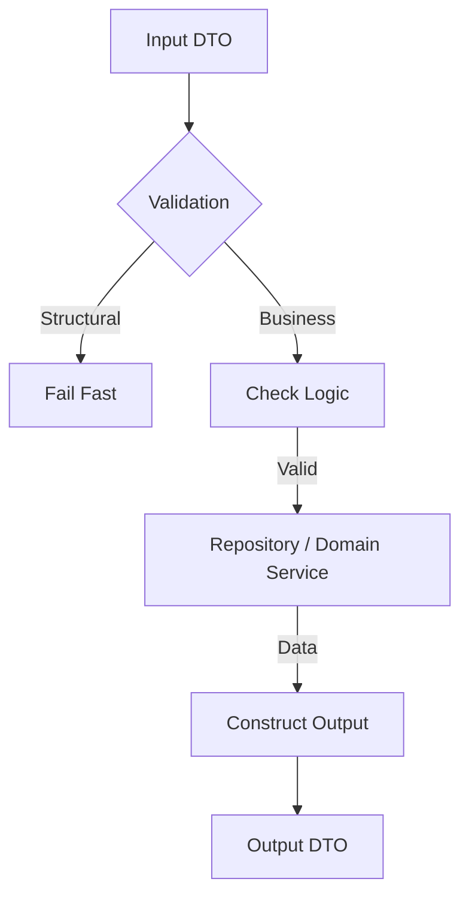

# UseCase Layer Convention (`convention_usecase.md`)

> **Role**: The UseCase Layer is the **Brain**. It houses all Business Logic.
> **Motto**: "Pure Go. No Frameworks. Strict Typing."

## 1. The Logic Flow



---

## 2. Core Principles

1.  **Framework Agnostic**: This layer **MUST NOT** import `gin`, `sqlboiler`, `mongo-driver`, or `amqp`. It only knows about _Interfaces_ and _Standard Library_.
2.  **Interface Driven**: Dependencies are injected.
3.  **Strict Inputs/Outputs**: Every public method uses a dedicated struct in `types.go`.

---

## 3. Implementation Details

### 3.1 Business vs. Structural Validation

Distinguish these two.

- **Structural (Delivery Layer)**: Simple format checks.
  - _Eg: "Is email valid?", "Is Age > 0?"_ - **Do this in Delivery.**
- **Business (UseCase Layer)**: Logic that requires knowledge of the system state.
  - _Eg: "Does this user exist?", "Is the shop active?", "Does user have permission X?"_ - **Do this in UseCase.**

### 3.2 The `New` Factory

Ensure dependencies are clearly defined.

```go
type implUseCase struct {
    repo   Repository
    l      pkgLog.Logger
    userUC user.UseCase // Dependency on another module
}

func New(repo Repository, l pkgLog.Logger, userUC user.UseCase) UseCase {
    return &implUseCase{
        repo:   repo,
        l:      l,
        userUC: userUC,
    }
}
```

### 3.3 Concurrency (Using `errgroup`)

Use `errgroup` for parallel processing. **NEVER** use naked `go func()` in UseCase without a wait mechanism (unless it's fire-and-forget, which should go to a Job/MQ).

```go
import "golang.org/x/sync/errgroup"

func (uc *implUseCase) Dashboard(ctx context.Context, id string) (DashboardOut, error) {
    g, ctx := errgroup.WithContext(ctx)
    var user models.User
    var stats models.Stats

    // 1. Fetch User
    g.Go(func() error {
        var err error
        user, err = uc.repo.GetUser(ctx, id)
        return err
    })

    // 2. Fetch Stats
    g.Go(func() error {
        var err error
        stats, err = uc.repo.GetStats(ctx, id)
        return err
    })

    // 3. Wait
    if err := g.Wait(); err != nil {
        uc.l.Errorf(ctx, "Dashboard failed: %v", err)
        return DashboardOut{}, err
    }

    return DashboardOut{User: user, Stats: stats}, nil
}
```

---

## 4. Anti-Patterns (The "Strictly Forbidden" List)

- ❌ **Forbidden Imports**:
  - `github.com/gin-gonic/gin` (This belongs in Delivery)
  - `github.com/volatiletech/sqlboiler` (This belongs in Repository)
- ❌ **Returning Models**:
  - Returning `models.User` directly exposes DB structure. Wrap it in `UserOutput`.
- ❌ **Silent Logs**:
  - `if err != nil { log.Error(err); return nil }` -> **WRONG**. Return the error!

---

## 5. Intern Checklist (Read before PR)

- [ ] **Import Check**: Did I import `gin` or `http`? **Remove it.**
- [ ] **Type Check**: Am I using `CreateInput` and `CreateOutput` structs?
- [ ] **Error Check**: Am I wrapping errors or using `uc_errors.go` definitions?
- [ ] **Logic Check**: Is this logic re-usable? If I call this from a CLI or Job, will it work? (If it relies on HTTP headers, the answer is NO).
