# API Sequence Diagrams

This document provides detailed sequence diagrams for all API flows in the SMAP Identity API.

## Table of Contents
- [Authentication Flows](#authentication-flows)
  - [1. User Registration Flow](#1-user-registration-flow)
  - [2. Send OTP Flow](#2-send-otp-flow)
  - [3. Verify OTP Flow](#3-verify-otp-flow)
  - [4. Login Flow](#4-login-flow)
- [Plan Management Flows](#plan-management-flows)
  - [5. Create Plan Flow](#5-create-plan-flow)
  - [6. Get Plans Flow](#6-get-plans-flow)
  - [7. Update Plan Flow](#7-update-plan-flow)
- [Subscription Management Flows](#subscription-management-flows)
  - [8. Create Subscription Flow](#8-create-subscription-flow)
  - [9. Get My Active Subscription Flow](#9-get-my-active-subscription-flow)
  - [10. Cancel Subscription Flow](#10-cancel-subscription-flow)

---

## Authentication Flows

### 1. User Registration Flow

This flow handles new user registration. The user provides email and password.

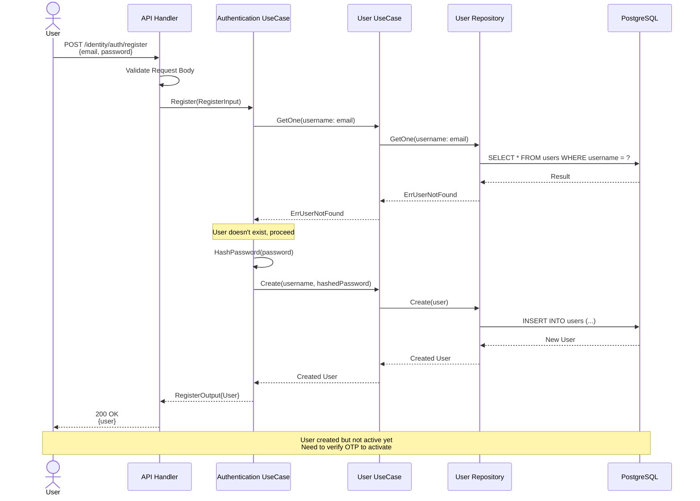

**Key Points:**
- User is created with `is_active = false`
- Password is hashed using bcrypt
- No subscription is created yet (only after OTP verification)

---

### 2. Send OTP Flow

This flow sends an OTP (One-Time Password) to the user's email for verification.

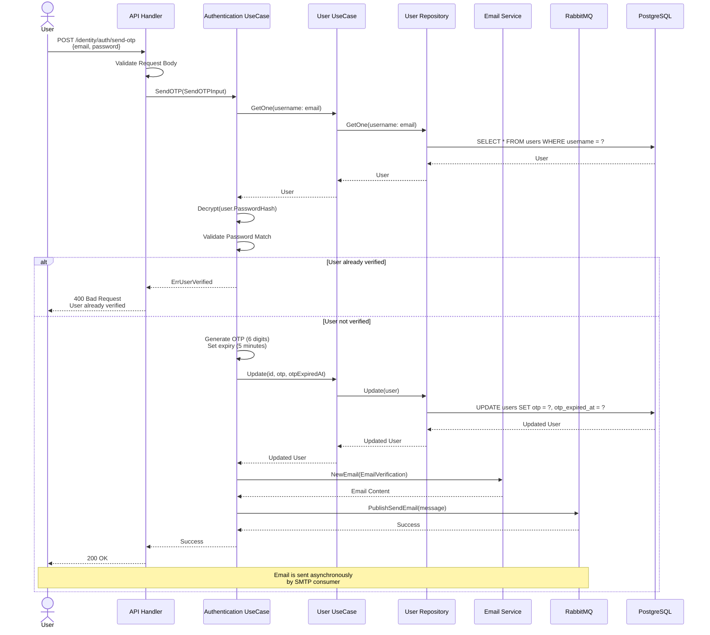

**Key Points:**
- OTP is generated with 6 digits and expires in 5 minutes
- Password must match to send OTP
- Email is sent asynchronously via RabbitMQ
- OTP can only be sent to unverified users

---

### 3. Verify OTP Flow

This flow verifies the OTP and activates the user account. It also creates a free trial subscription.

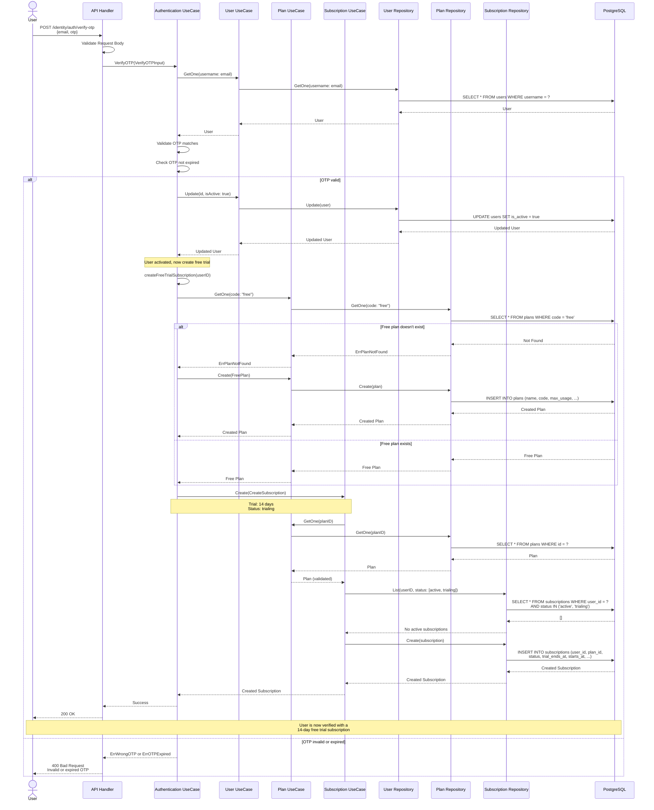

**Key Points:**
- OTP must be valid and not expired
- User account is activated (`is_active = true`)
- Free plan is created if it doesn't exist (code: "free", max_usage: 100)
- Trial subscription is created with 14 days duration
- If subscription creation fails, user is still activated

---

### 4. Login Flow

This flow authenticates the user and returns an access token.

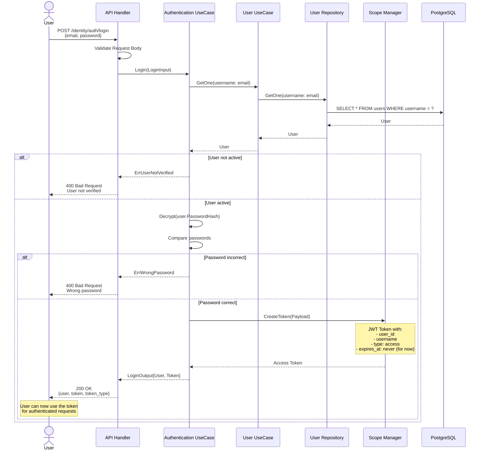

**Key Points:**
- User must be verified (`is_active = true`) to login
- Password is validated against the stored hash
- JWT token is generated with user information
- Token currently doesn't expire (expires_at: 0)

---

## Plan Management Flows

### 5. Create Plan Flow

This flow creates a new subscription plan. Requires authentication.

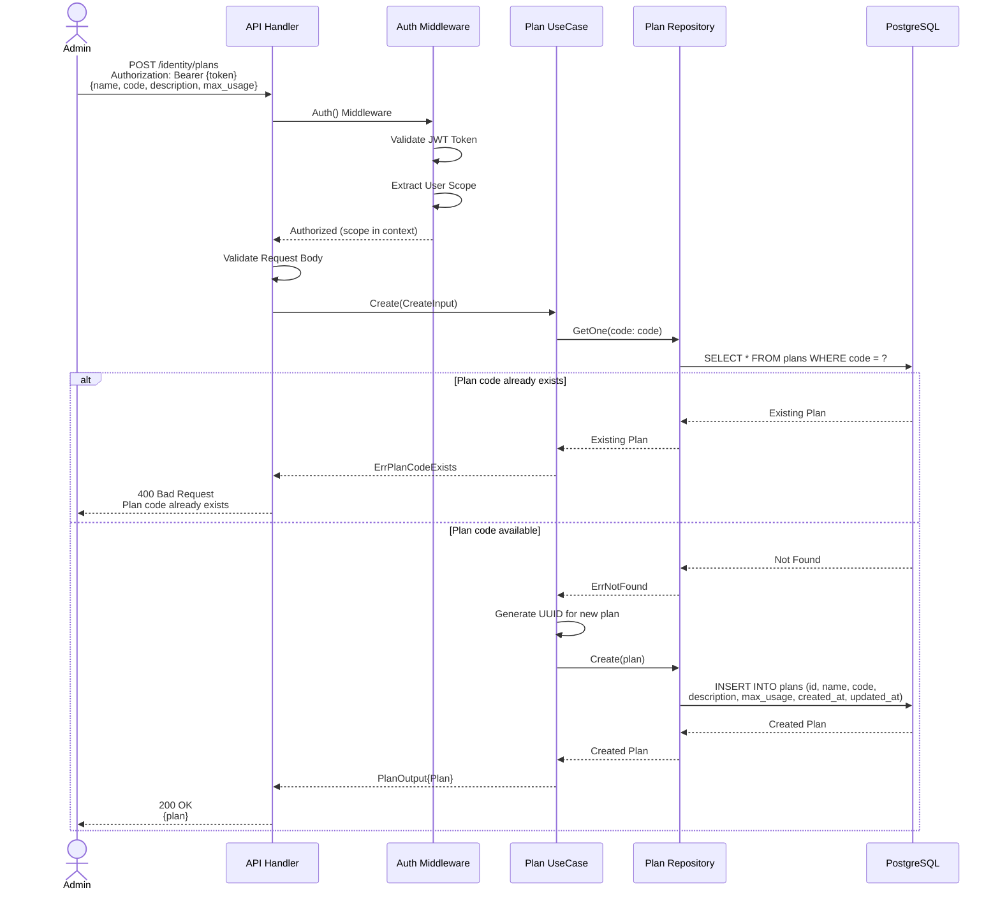

**Key Points:**
- Authentication required
- Plan code must be unique
- `max_usage` defines API call limit
- Plan is not deleted permanently, uses soft delete

---

### 6. Get Plans Flow

This flow retrieves a list of plans with optional pagination and filtering.

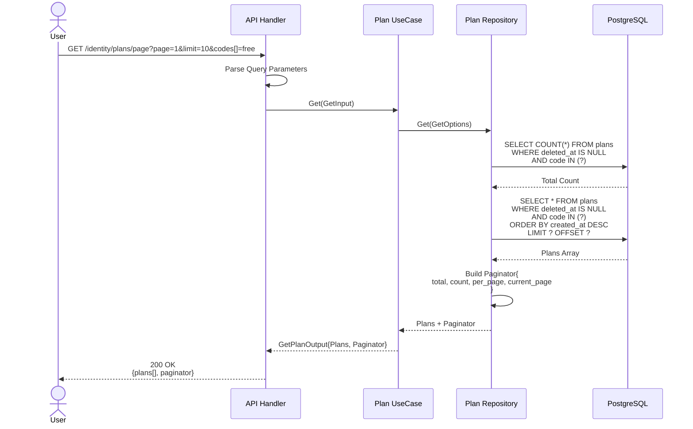

**Alternative Flow (List without pagination):**
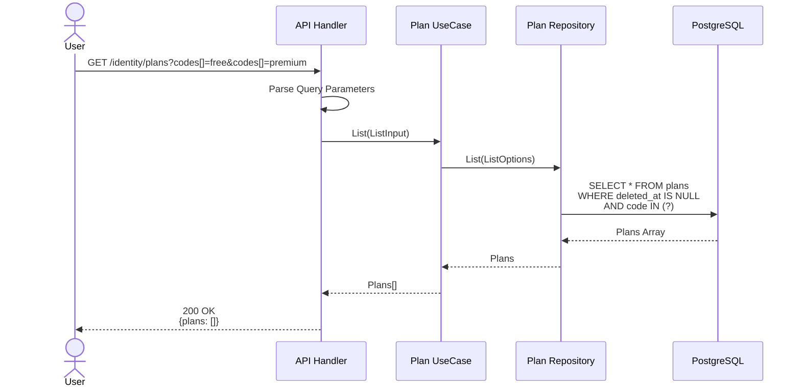

**Key Points:**
- No authentication required for listing plans
- Supports filtering by IDs and codes
- Pagination with adjustable page size
- Only returns non-deleted plans

---

### 7. Update Plan Flow

This flow updates an existing plan. Requires authentication.

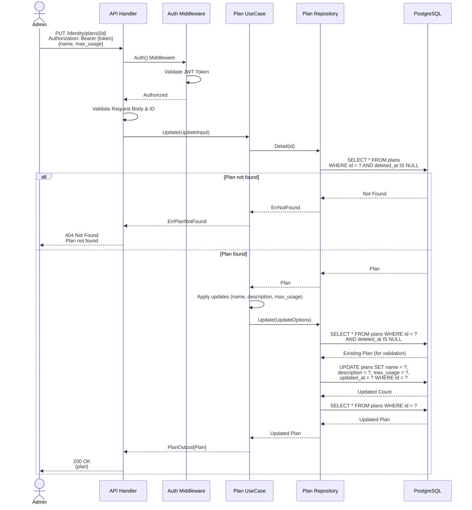

**Key Points:**
- Authentication required
- Only updates provided fields (partial update)
- Plan code cannot be updated (immutable)
- Returns the updated plan

---

## Subscription Management Flows

### 8. Create Subscription Flow

This flow creates a new subscription for a user. Requires authentication.

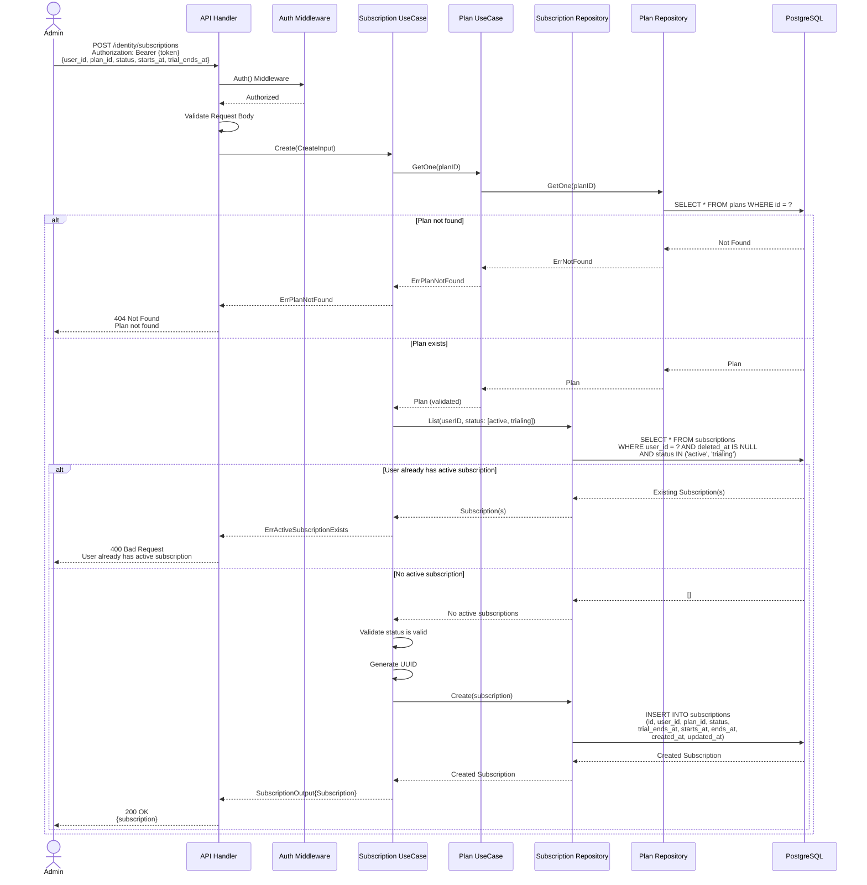

**Key Points:**
- Authentication required
- Plan must exist
- User can only have one active/trialing subscription at a time
- Subscription status must be valid
- Supports trial subscriptions with `trial_ends_at`

---

### 9. Get My Active Subscription Flow

This flow retrieves the current user's active subscription.

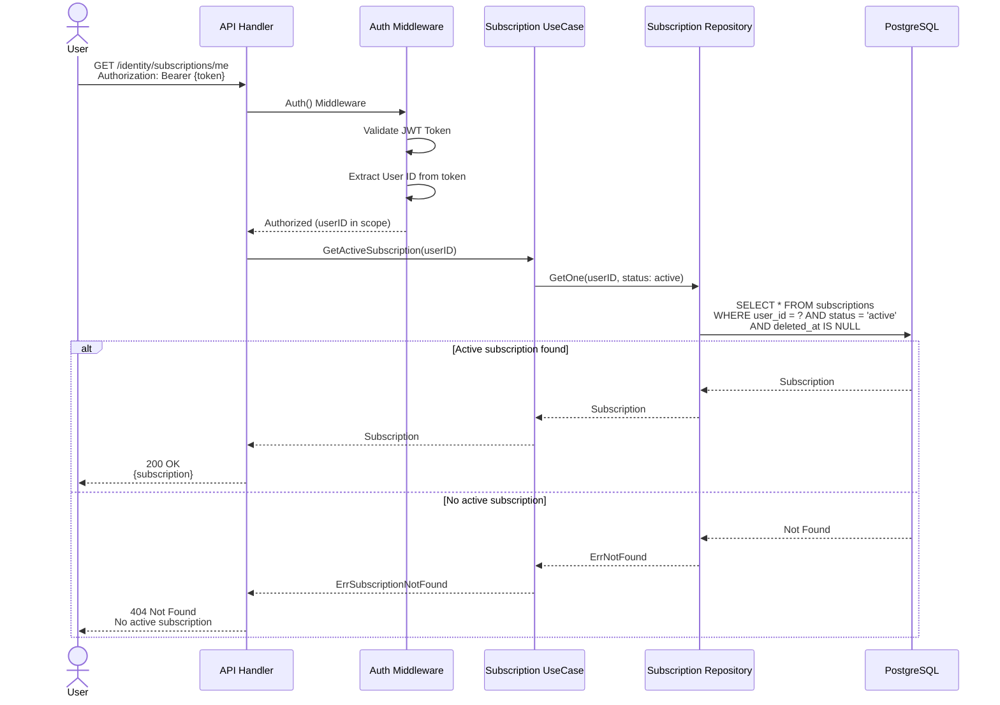

**Key Points:**
- Authentication required
- Returns only active subscription (not trialing or expired)
- User can only see their own subscription
- Common use case: Check user's current plan and usage limits

---

### 10. Cancel Subscription Flow

This flow cancels an active or trialing subscription.

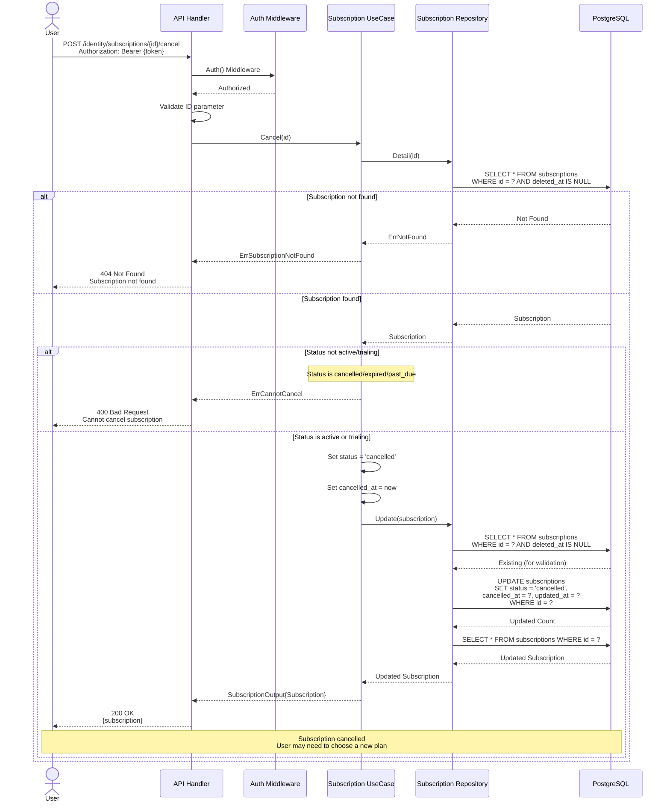

**Key Points:**
- Authentication required
- Only active or trialing subscriptions can be cancelled
- Sets `cancelled_at` timestamp
- Status changes to `cancelled`
- Cannot cancel already cancelled, expired, or past_due subscriptions

---

## Additional Flows

### 11. List User's Subscriptions

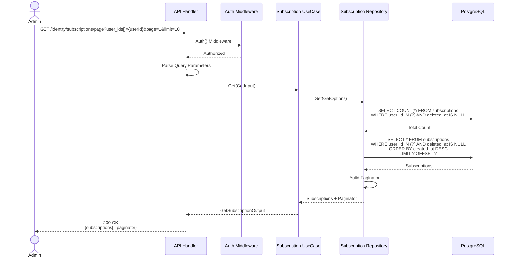

---

## Error Handling Patterns

All API flows follow consistent error handling:

### Common HTTP Status Codes

- **200 OK**: Successful operation
- **400 Bad Request**: 
  - Invalid request body
  - Validation errors
  - Business logic errors (e.g., user already exists, wrong password)
- **401 Unauthorized**: Missing or invalid authentication token
- **404 Not Found**: Resource not found (user, plan, subscription)
- **500 Internal Server Error**: Unexpected server errors

### Error Response Format

```json
{
  "error": {
    "code": 110004,
    "message": "Username existed"
  }
}
```

### Error Code Ranges

- **110xxx**: Authentication errors
- **120xxx**: Plan errors
- **130xxx**: Subscription errors

---

## Summary

This API implements a complete subscription-based system with the following key features:

1. **User Authentication**: Registration, OTP verification, and login
2. **Automatic Free Trial**: 14-day trial subscription created on verification
3. **Plan Management**: CRUD operations for subscription plans
4. **Subscription Management**: Create, read, update, cancel subscriptions
5. **Access Control**: JWT-based authentication for protected endpoints

### Flow Integration

The flows are integrated as follows:
1. User registers → Receives OTP
2. User verifies OTP → Account activated + Free trial subscription created
3. User logs in → Receives JWT token
4. User can view their subscription status
5. Admin can manage plans and subscriptions

### Database Schema Dependencies

- **users** table: Stores user information
- **plans** table: Stores subscription plans
- **subscriptions** table: Links users to plans with status and dates
  - Foreign key: `user_id` → `users.id`
  - Foreign key: `plan_id` → `plans.id`

