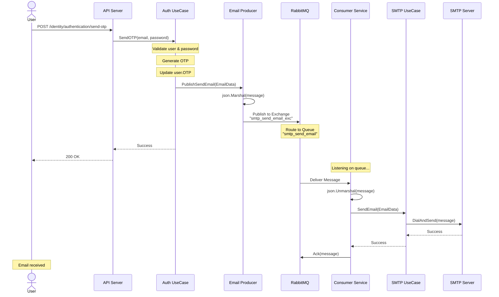

# SMAP Consumer Service

Flow diagrams and architecture for Consumer Service.

## Table of Contents
- [Email Sending Flow](#email-sending-flow)

---

## Email Sending Flow

Email sending flow from API request to email delivery.

**Key Points:**
- Asynchronous email sending decoupled from API response
- RabbitMQ ensures message delivery reliability
- Consumer processes messages in background
- SMTP UseCase handles actual email delivery
- Message acknowledgment after successful send

---

*Last updated: November 20, 2025*

