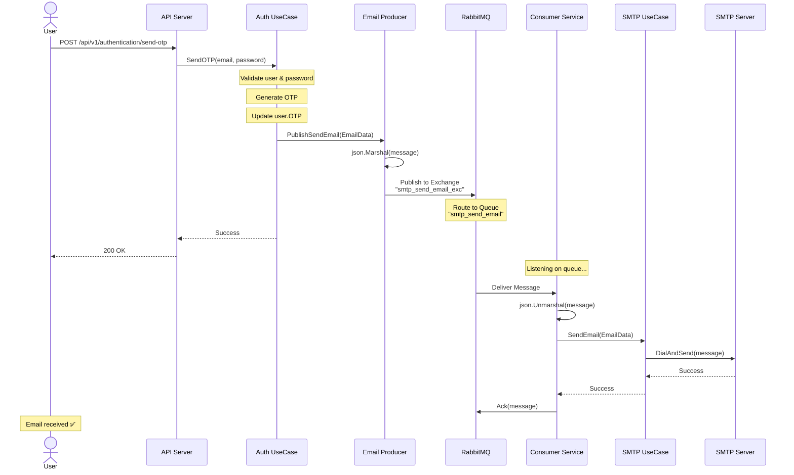

# 🔄 Consumer Service Flow Diagrams

## 📧 Email Sending Flow (Complete)



---

## 🏗️ System Architecture

```
┌──────────────────────────────────────────────────────────────────────────┐
│                          API Server (Port 8080)                          │
├──────────────────────────────────────────────────────────────────────────┤
│  HTTP Handlers                                                           │
│  ├─ Authentication Handler                                               │
│  ├─ Plan Handler                                                         │
│  └─ Subscription Handler                                                 │
│                                                                           │
│  UseCases                                                                │
│  ├─ Authentication UseCase ──► Email Producer ──┐                        │
│  ├─ Plan UseCase                                │                        │
│  └─ Subscription UseCase                        │                        │
│                                                  │                        │
│  Repositories                                    │                        │
│  ├─ User Repository                              │                        │
│  ├─ Plan Repository                              │                        │
│  └─ Subscription Repository                      │                        │
└──────────────────────────────────────────────────┼──────────────────────┘
                                                    │
                                                    │ Publish
                                                    ▼
┌──────────────────────────────────────────────────────────────────────────┐
│                          RabbitMQ (Port 5672)                            │
├──────────────────────────────────────────────────────────────────────────┤
│  Exchanges                                                               │
│  └─ smtp_send_email_exc (fanout)                                         │
│                                                                           │
│  Queues                                                                  │
│  └─ smtp_send_email                                                      │
│      ├─ Durable: true                                                    │
│      ├─ Bound to: smtp_send_email_exc                                    │
│      └─ Messages: EmailData (JSON)                                       │
└──────────────────────────────────────────────────┬──────────────────────┘
                                                    │
                                                    │ Consume
                                                    ▼
┌──────────────────────────────────────────────────────────────────────────┐
│                        Consumer Service (No port)                        │
├──────────────────────────────────────────────────────────────────────────┤
│  Consumer Orchestrator                                                   │
│  └─ Graceful shutdown handler                                            │
│                                                                           │
│  Consumers                                                               │
│  └─ SMTP Consumer                                                        │
│      ├─ Listen on: smtp_send_email                                       │
│      ├─ Worker: sendEmailWorker()                                        │
│      └─ Calls: SMTP UseCase                                              │
│                                                                           │
│  UseCases                                                                │
│  └─ SMTP UseCase ────────────────────────┐                               │
└──────────────────────────────────────────┼──────────────────────────────┘
                                            │
                                            │ Send Email
                                            ▼
┌──────────────────────────────────────────────────────────────────────────┐
│                         SMTP Server (Port 587)                           │
│                     (Gmail, SendGrid, Mailgun, etc.)                     │
└──────────────────────────────────────────────────────────────────────────┘
                                            │
                                            │ Deliver
                                            ▼
                                    ┌───────────────┐
                                    │  User's Email │
                                    └───────────────┘
```

---

## 📊 Component Diagram

```
┌─────────────────────────────────────────────────────────────────────────┐
│                         Consumer Service Process                        │
├─────────────────────────────────────────────────────────────────────────┤
│                                                                          │
│  main.go                                                                │
│  ├─ Load Config (.env)                                                  │
│  ├─ Init Logger (Zap)                                                   │
│  ├─ Connect PostgreSQL                                                  │
│  ├─ Connect RabbitMQ                                                    │
│  └─ Init Consumer Service ──┐                                           │
│                              │                                           │
│  ┌───────────────────────────▼────────────────────────────────┐         │
│  │  Consumer Service (internal/consumer/)                     │         │
│  │  ├─ consumer.go: Orchestration & Shutdown                  │         │
│  │  ├─ new.go: Dependency injection                           │         │
│  │  └─ error.go: Custom errors                                │         │
│  │                                                             │         │
│  │  ┌──────────────────────────────────────────────────────┐  │         │
│  │  │  SMTP Consumer                                       │  │         │
│  │  │  (internal/smtp/rabbitmq/consumer/)                 │  │         │
│  │  │  ├─ consumer.go: Consume() & sendEmailWorker()      │  │         │
│  │  │  ├─ common.go: consume() helper                     │  │         │
│  │  │  └─ new.go: Constructor                             │  │         │
│  │  │                                                       │  │         │
│  │  │  ┌────────────────────────────────────────────────┐ │  │         │
│  │  │  │  SMTP UseCase                                  │ │  │         │
│  │  │  │  (internal/smtp/usecase/)                     │ │  │         │
│  │  │  │  ├─ smtp.go: SendEmail() implementation        │ │  │         │
│  │  │  │  └─ new.go: Constructor                        │ │  │         │
│  │  │  │                                                 │ │  │         │
│  │  │  │  Uses: github.com/go-mail/mail/v2              │ │  │         │
│  │  │  └─────────────────────────────────────────────────┘ │  │         │
│  │  └──────────────────────────────────────────────────────┘  │         │
│  └─────────────────────────────────────────────────────────────┘         │
│                                                                          │
│  Signal Handler (SIGINT, SIGTERM)                                       │
│  └─ Graceful shutdown                                                   │
└──────────────────────────────────────────────────────────────────────────┘
```

---

## 🔄 Message Flow Detail

### 1. Producer Side (API Server)

```
Authentication UseCase
    │
    ├─ GenerateOTP()
    │
    ├─ UpdateUser(OTP)
    │
    └─ PublishSendEmail()
        │
        ▼
    Email Producer
        │
        ├─ Create EmailData struct
        │
        ├─ json.Marshal(emailData)
        │
        └─ Publish to RabbitMQ
            │
            ├─ Exchange: "smtp_send_email_exc"
            ├─ Type: fanout
            ├─ ContentType: "application/json"
            └─ Body: JSON bytes
```

### 2. RabbitMQ Routing

```
Exchange: smtp_send_email_exc (fanout)
    │
    ├─ Binding ──► Queue: smtp_send_email
    │               │
    │               ├─ Durable: true
    │               ├─ Auto-delete: false
    │               └─ Messages: [{EmailData}, {EmailData}, ...]
    │
    └─ [Future] Binding ──► Queue: email_backup
                            └─ For audit/backup purposes
```

### 3. Consumer Side

```
Consumer Service (Startup)
    │
    ├─ Connect to RabbitMQ
    │
    ├─ Declare Exchange: smtp_send_email_exc
    │
    ├─ Declare Queue: smtp_send_email
    │
    ├─ Bind Queue to Exchange
    │
    └─ Start consuming
        │
        ▼
    For each message:
        │
        ├─ Receive amqp.Delivery
        │
        ├─ json.Unmarshal(d.Body, &emailData)
        │
        ├─ Call SMTP UseCase
        │   │
        │   ├─ Create gomail.Message
        │   ├─ Set headers (From, To, Subject)
        │   ├─ Set body (HTML)
        │   ├─ Add attachments (if any)
        │   └─ Send via SMTP
        │
        └─ Acknowledge message
            │
            ├─ Success: d.Ack(false)
            └─ Error: Don't ack (will retry)
```

---

## 🚀 Deployment Architecture

### Development (Local)

```
┌────────────────────────────────────────────────────────┐
│  Developer Machine (Apple Silicon M4)                  │
├────────────────────────────────────────────────────────┤
│                                                         │
│  Terminal 1: make run-api                              │
│  ├─ API Server on :8080                                │
│  └─ Connects to localhost RabbitMQ                     │
│                                                         │
│  Terminal 2: make run-consumer                         │
│  ├─ Consumer Service                                   │
│  └─ Connects to localhost RabbitMQ                     │
│                                                         │
│  Docker: RabbitMQ                                      │
│  └─ docker run -d -p 5672:5672 -p 15672:15672 rabbitmq│
│                                                         │
│  Docker: PostgreSQL                                    │
│  └─ docker run -d -p 5432:5432 postgres               │
└────────────────────────────────────────────────────────┘
```

### Production (Docker Compose)

```yaml
version: '3.8'
services:
  postgres:
    image: postgres:15-alpine
    ports: ["5432:5432"]
    
  rabbitmq:
    image: rabbitmq:3-management-alpine
    ports: ["5672:5672", "15672:15672"]
    
  api:
    image: smap-identity:latest
    ports: ["8080:8080"]
    depends_on: [postgres, rabbitmq]
    
  consumer:
    image: smap-consumer:latest
    depends_on: [postgres, rabbitmq]
    deploy:
      replicas: 2  # Scale for throughput
```

### Production (Kubernetes)

```yaml
apiVersion: apps/v1
kind: Deployment
metadata:
  name: smap-consumer
spec:
  replicas: 3
  selector:
    matchLabels:
      app: smap-consumer
  template:
    spec:
      containers:
      - name: consumer
        image: registry/smap-consumer:latest
        resources:
          requests:
            memory: "128Mi"
            cpu: "100m"
          limits:
            memory: "256Mi"
            cpu: "200m"
        envFrom:
        - secretRef:
            name: smap-secrets
```

---

## 📈 Scaling Strategy

### Horizontal Scaling

```
                    ┌─────────────────┐
                    │    RabbitMQ     │
                    │                 │
                    │  Queue: smtp    │
                    │  [Msg1, Msg2,   │
                    │   Msg3, Msg4]   │
                    └────────┬────────┘
                             │
                ┌────────────┼────────────┐
                │            │            │
                ▼            ▼            ▼
        ┌─────────────┐ ┌─────────────┐ ┌─────────────┐
        │ Consumer 1  │ │ Consumer 2  │ │ Consumer 3  │
        │             │ │             │ │             │
        │ Msg1 ──► ✅ │ │ Msg2 ──► ✅ │ │ Msg3 ──► ✅ │
        └─────────────┘ └─────────────┘ └─────────────┘
```

**Benefits:**
- RabbitMQ round-robin distributes messages
- Parallel processing → Higher throughput
- Fault tolerance (if one consumer dies, others continue)

### When to Scale

| Queue Depth | Action |
|-------------|--------|
| < 100 | 1-2 consumers sufficient |
| 100 - 1000 | Add 2-3 consumers |
| 1000+ | Add 5+ consumers or investigate bottleneck |

---

## 🔧 Monitoring & Observability

### Metrics to Collect

```
Consumer Service Metrics:
├─ messages_consumed_total (counter)
├─ messages_processed_success (counter)
├─ messages_processed_errors (counter)
├─ message_processing_duration_seconds (histogram)
├─ smtp_send_duration_seconds (histogram)
└─ active_goroutines (gauge)

RabbitMQ Metrics:
├─ queue_depth (gauge)
├─ message_publish_rate (gauge)
├─ message_consume_rate (gauge)
└─ connection_count (gauge)
```

### Log Examples

```json
// Consumer started
{
  "level": "info",
  "msg": "Starting SMAP Consumer Service...",
  "ts": "2025-01-01T10:00:00Z"
}

// Processing message
{
  "level": "info",
  "msg": "smtp.delivery.rabbitmq.consumer.sendEmailWorker",
  "recipient": "user@example.com",
  "subject": "Email Verification",
  "ts": "2025-01-01T10:00:01Z"
}

// Email sent
{
  "level": "info",
  "msg": "Email sent successfully",
  "recipient": "user@example.com",
  "duration_ms": 1234,
  "ts": "2025-01-01T10:00:02Z"
}

// Error
{
  "level": "error",
  "msg": "smtp.usecase.SendEmail.DialAndSend: 535 Authentication failed",
  "recipient": "user@example.com",
  "ts": "2025-01-01T10:00:03Z"
}
```

---

## ✅ Checklist for Production

### Pre-Deployment

- [ ] Environment variables configured (`.env` or Secrets)
- [ ] SMTP credentials valid and tested
- [ ] RabbitMQ connection string correct
- [ ] PostgreSQL connection tested
- [ ] Docker image built and pushed to registry
- [ ] Health check endpoint implemented (optional)
- [ ] Monitoring/alerting configured

### Deployment

- [ ] Deploy consumer service
- [ ] Verify RabbitMQ connection
- [ ] Check consumer logs (no errors)
- [ ] Send test email via API
- [ ] Verify email received
- [ ] Monitor queue depth (should be ~0)

### Post-Deployment

- [ ] Set up alerts (queue depth, error rate)
- [ ] Monitor resource usage (CPU, memory)
- [ ] Test failure scenarios (RabbitMQ down, SMTP down)
- [ ] Document runbook for common issues
- [ ] Schedule regular health checks

---

**Consumer Service Flow Documentation Complete! 🎉**

