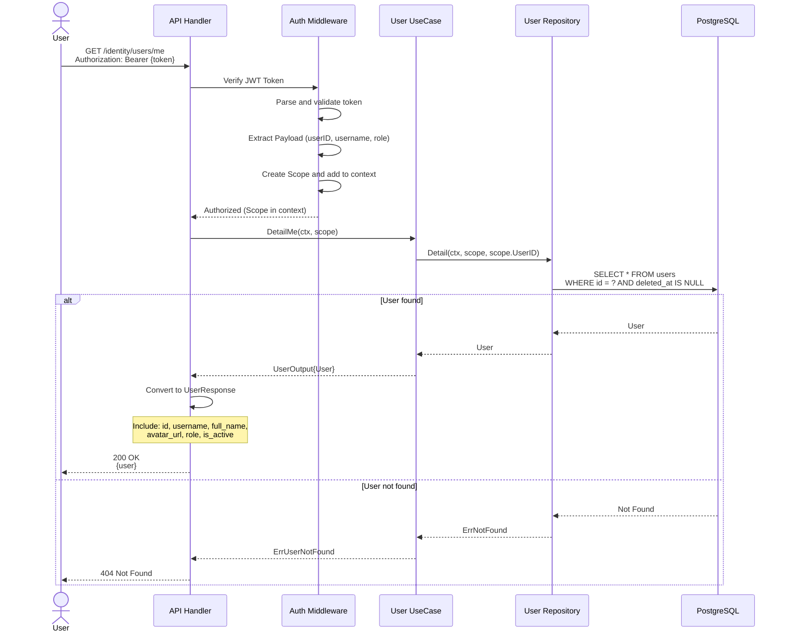
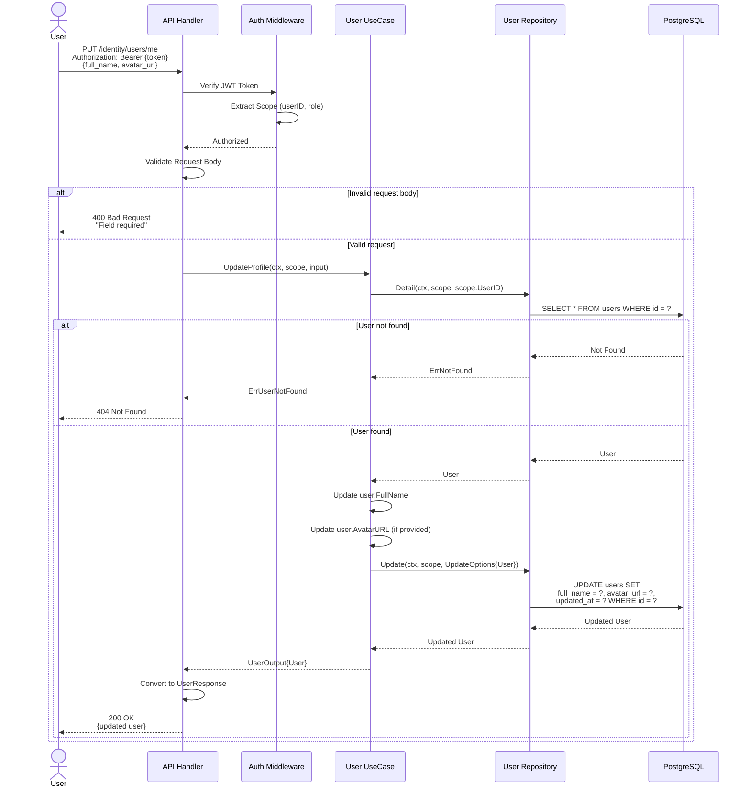
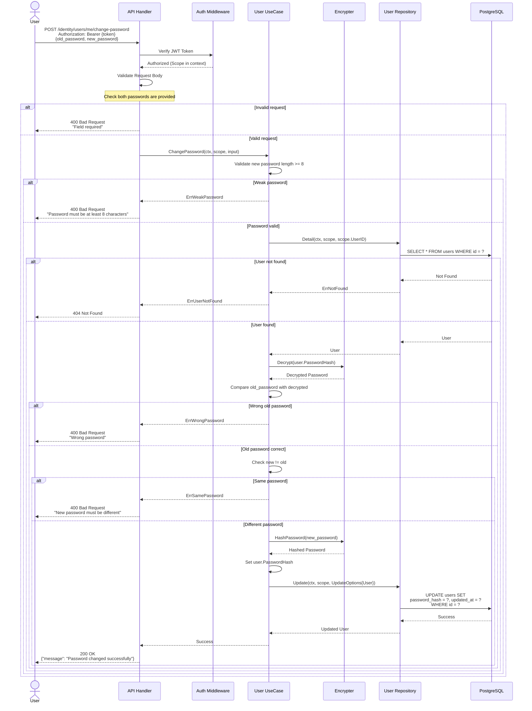
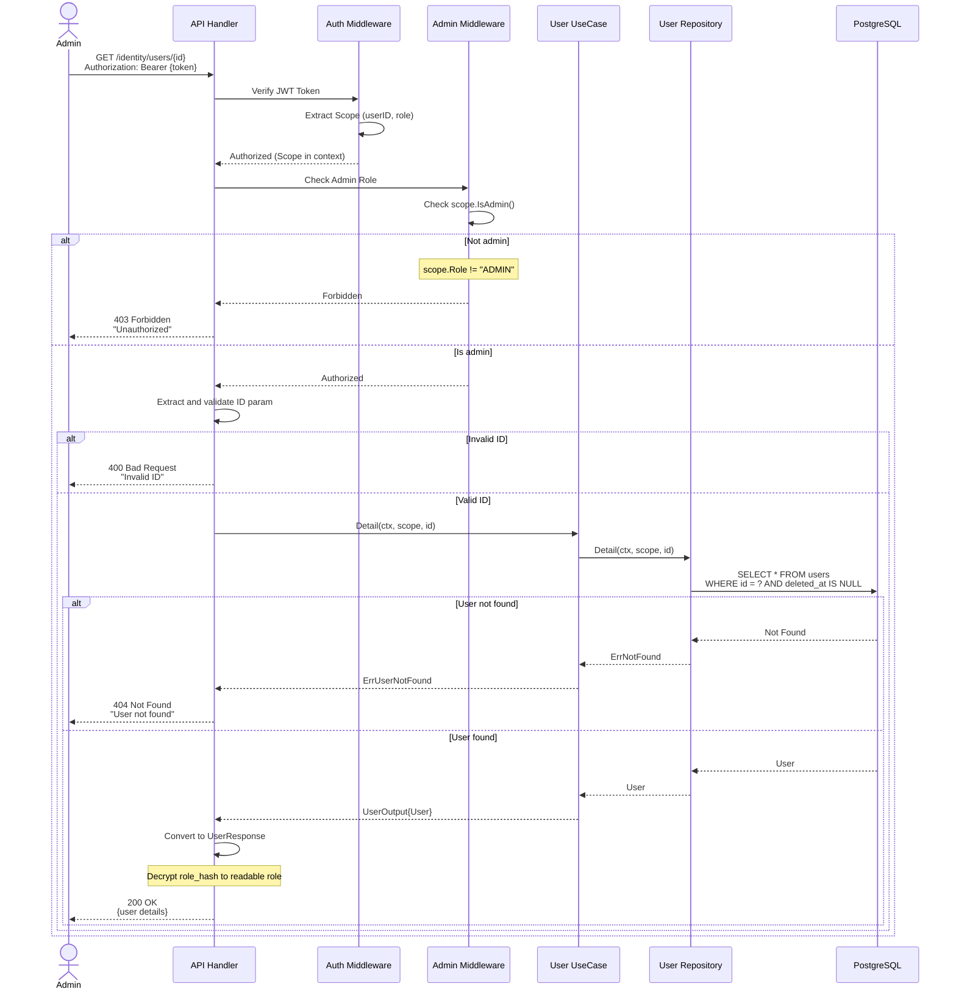
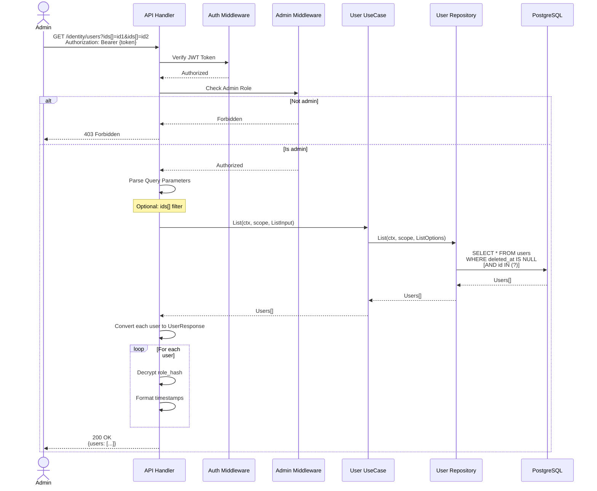
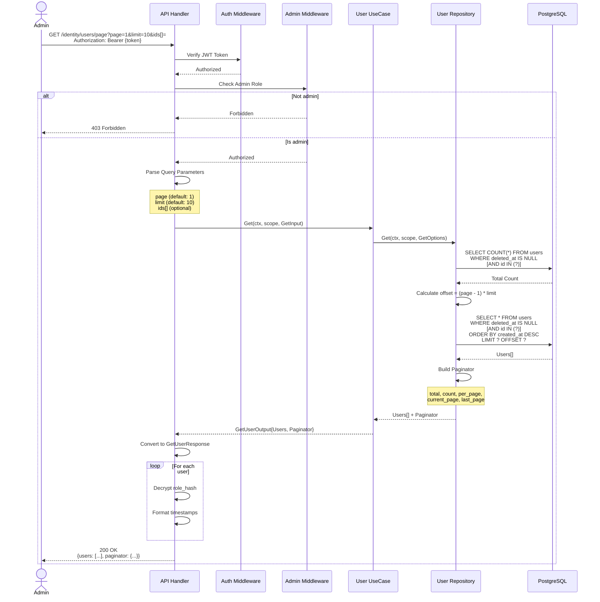

# User API Sequence Diagrams

Complete sequence diagrams for all User/Profile management API endpoints.

## Table of Contents
- [User Profile Flows](#user-profile-flows)
  - [1. Get My Profile Flow](#1-get-my-profile-flow)
  - [2. Update My Profile Flow](#2-update-my-profile-flow)
  - [3. Change Password Flow](#3-change-password-flow)
- [Admin User Management Flows](#admin-user-management-flows)
  - [4. Get User Detail (Admin) Flow](#4-get-user-detail-admin-flow)
  - [5. List Users (Admin) Flow](#5-list-users-admin-flow)
  - [6. Get Users with Pagination (Admin) Flow](#6-get-users-with-pagination-admin-flow)

---

## User Profile Flows

### 1. Get My Profile Flow

This flow retrieves the current authenticated user's profile information.



**Key Points:**
- User can only view their own profile
- Role is decrypted from `role_hash` before response
- Password hash is never returned to client
- Requires valid JWT authentication

---

### 2. Update My Profile Flow

This flow updates the authenticated user's profile information (full name and avatar).



**Key Points:**
- User can only update their own profile
- Only `full_name` and `avatar_url` can be updated
- Username, role, and password cannot be changed via this endpoint
- `updated_at` timestamp is automatically set

---

### 3. Change Password Flow

This flow changes the authenticated user's password after verifying the old password.



**Key Points:**
- Old password must be correct to change
- New password must be at least 8 characters
- New password must be different from old password
- Password is encrypted before storage using bcrypt
- User is not logged out (JWT token remains valid)

**Security Considerations:**
- Password validation on server side
- Encrypted storage prevents plaintext exposure
- All password operations are logged for audit

---

## Admin User Management Flows

### 4. Get User Detail (Admin) Flow

This flow retrieves detailed information about a specific user by ID. **Admin only.**



**Key Points:**
- **Admin authentication required** via `AdminOnly()` middleware
- Admin can view any user's profile
- User's role is decrypted and included in response
- Password hash is never exposed

---

### 5. List Users (Admin) Flow

This flow lists all users without pagination. **Admin only.**



**Key Points:**
- **Admin only** endpoint
- Returns all users (no pagination)
- Optional filtering by user IDs
- Useful for admin dashboards or bulk operations
- Role is decrypted for each user

---

### 6. Get Users with Pagination (Admin) Flow

This flow retrieves users with pagination support. **Admin only.**



**Response Format:**
```json
{
  "users": [
    {
      "id": "uuid",
      "username": "user@example.com",
      "full_name": "John Doe",
      "avatar_url": "https://...",
      "role": "USER",
      "is_active": true,
      "created_at": "2025-01-01T00:00:00Z",
      "updated_at": "2025-01-01T00:00:00Z"
    }
  ],
  "paginator": {
    "total": 100,
    "count": 10,
    "per_page": 10,
    "current_page": 1,
    "last_page": 10
  }
}
```

**Key Points:**
- **Admin only** endpoint
- Pagination parameters: `page`, `limit`
- Optional filtering by user IDs
- Returns paginator metadata for UI
- Efficient for large user lists

---

## Role-Based Access Control (RBAC)

### Role Types

| Role | Value | Encrypted | Description |
|------|-------|-----------|-------------|
| User | `USER` | SHA256 hash | Default role for regular users |
| Admin | `ADMIN` | SHA256 hash | Admin role with elevated privileges |

### Role Encryption

Roles are encrypted using SHA256 with a salt before storage to prevent:
- Direct string comparison attacks
- Database value manipulation
- Accidental role exposure in logs

**Encryption Process:**
```go
// Encrypt role
hash := sha256.Sum256([]byte(role + ":smap:role"))
encrypted := base64.StdEncoding.EncodeToString(hash[:])

// Verify role
encrypted_input := encrypt(input_role)
is_valid := encrypted_input == stored_role_hash
```

### Role Assignment

- **Default Role**: All new users get `USER` role automatically
- **Admin Role**: Must be assigned manually via database or admin tools
- **Role in JWT**: Role is included in JWT token payload for efficient authorization

### Middleware Stack

```
Request
  ↓
Auth() Middleware
  ├─ Verify JWT token
  ├─ Extract payload (userID, username, role)
  └─ Create Scope and add to context
  ↓
AdminOnly() Middleware (for admin endpoints)
  ├─ Check scope.IsAdmin()
  ├─ If not admin → 403 Forbidden
  └─ If admin → Continue
  ↓
Handler
```

---

## API Summary

### User Endpoints (Authenticated Users)

| Method | Endpoint | Description | Auth | Admin |
|--------|----------|-------------|------|-------|
| GET | `/users/me` | Get my profile | ✅ | ❌ |
| PUT | `/users/me` | Update my profile | ✅ | ❌ |
| POST | `/users/me/change-password` | Change password | ✅ | ❌ |

### Admin Endpoints (Admin Only)

| Method | Endpoint | Description | Auth | Admin |
|--------|----------|-------------|------|-------|
| GET | `/users` | List all users | ✅ | ✅ |
| GET | `/users/page` | List users with pagination | ✅ | ✅ |
| GET | `/users/:id` | Get user by ID | ✅ | ✅ |

---

## Error Codes

### User Module Error Codes (140xxx)

| Code | Error | Description |
|------|-------|-------------|
| 140001 | Wrong Body | Invalid request body format |
| 140002 | User Not Found | User does not exist |
| 140003 | User Exists | User already exists (for creation) |
| 140004 | Field Required | Required field is missing |
| 140005 | Invalid ID | Invalid user ID format |
| 140006 | Wrong Password | Incorrect old password |
| 140007 | Weak Password | Password too short (< 8 chars) |
| 140008 | Same Password | New password same as old |
| 140009 | Invalid Role | Role value is invalid |
| 140010 | Unauthorized | Not authorized to perform action |

---

## Security Considerations

### Password Management
- ✅ Minimum 8 characters
- ✅ Encrypted storage (bcrypt)
- ✅ Cannot reuse old password
- ✅ Validation on both client and server

### Role Security
- ✅ Role encrypted with SHA256
- ✅ Cannot modify role via profile update
- ✅ Role checked on every request via JWT
- ✅ Middleware enforces admin-only endpoints

### Data Privacy
- ✅ Users can only view/edit their own profile
- ✅ Password hash never exposed in responses
- ✅ Soft delete preserves data for audit
- ✅ Admin actions logged for compliance

### JWT Token
- ✅ Includes role for efficient authorization
- ✅ Signed with secret key (HMAC-SHA256)
- ✅ Verified on every request
- ✅ Includes user ID, username, role

---

## Integration with Authentication Flow

### User Creation Flow

```
Register → (User created with role=USER)
    ↓
Send OTP
    ↓
Verify OTP → (User activated + Free trial subscription created)
    ↓
Login → (JWT token includes role)
    ↓
Access /users/me → (Role checked from JWT)
```

### Role-Based Flows

```
User Login
    ↓
JWT Created with role field
    ↓
User makes request
    ↓
Auth Middleware extracts role from JWT
    ↓
AdminOnly Middleware checks role
    ↓
    ├─ If USER → 403 for admin endpoints
    └─ If ADMIN → Access granted
```

---

## Testing Scenarios

### User Profile Tests
1. ✅ Get own profile (authenticated)
2. ✅ Update own profile (full name, avatar)
3. ✅ Change password with correct old password
4. ❌ Change password with wrong old password
5. ❌ Change password to same password
6. ❌ Change password to weak password (< 8 chars)

### Admin User Management Tests
1. ✅ Admin can list all users
2. ✅ Admin can get any user's detail
3. ✅ Admin can use pagination
4. ❌ Regular user cannot access admin endpoints
5. ❌ Unauthenticated request returns 401
6. ❌ Non-admin authenticated request returns 403

---

## Database Schema

### Users Table

```sql
CREATE TABLE users (
    id UUID PRIMARY KEY,
    username VARCHAR(255) UNIQUE NOT NULL,
    full_name VARCHAR(255),
    password_hash TEXT,
    role_hash TEXT,              -- Encrypted role (USER or ADMIN)
    avatar_url TEXT,
    is_active BOOLEAN DEFAULT false,
    otp VARCHAR(6),
    otp_expired_at TIMESTAMP,
    created_at TIMESTAMP NOT NULL DEFAULT NOW(),
    updated_at TIMESTAMP NOT NULL DEFAULT NOW(),
    deleted_at TIMESTAMP         -- Soft delete
);

-- Indexes
CREATE INDEX idx_users_username ON users(username);
CREATE INDEX idx_users_deleted_at ON users(deleted_at);
CREATE INDEX idx_users_is_active ON users(is_active);
```

---

## Related Documentation

- **Authentication APIs**: `api_01_sequence_diagrams.md`
- **Plan & Subscription APIs**: `api_01_sequence_diagrams.md`
- **Implementation Summary**: `api_02_implementation_summary.md`

---

**User API Documentation Complete! 👤🔐**

*Last updated: November 2025*

