# SMAP Identity API

Sequence diagrams for API flows in SMAP Identity Service.

## Table of Contents
- [Authentication Flows](#authentication-flows)
  - [1. User Registration Flow](#1-user-registration-flow)
  - [2. Send OTP Flow](#2-send-otp-flow)
  - [3. Verify OTP Flow](#3-verify-otp-flow)
  - [4. Login Flow](#4-login-flow)
- [Plan Management Flows](#plan-management-flows)
  - [5. Create Plan Flow](#5-create-plan-flow)
  - [6. Get Plans Flow](#6-get-plans-flow)
  - [7. Update Plan Flow](#7-update-plan-flow)
- [Subscription Management Flows](#subscription-management-flows)
  - [8. Create Subscription Flow](#8-create-subscription-flow)
  - [9. Get My Active Subscription Flow](#9-get-my-active-subscription-flow)
  - [10. Cancel Subscription Flow](#10-cancel-subscription-flow)
  - [11. List User's Subscriptions Flow](#11-list-users-subscriptions-flow)
- [User Management Flows](#user-management-flows)
  - [12. Get My Profile Flow](#12-get-my-profile-flow)
  - [13. Update My Profile Flow](#13-update-my-profile-flow)
  - [14. Change Password Flow](#14-change-password-flow)
- [Admin User Management Flows](#admin-user-management-flows)
  - [15. Get User Detail (Admin) Flow](#15-get-user-detail-admin-flow)
  - [16. List Users (Admin) Flow](#16-list-users-admin-flow)
  - [17. Get Users with Pagination (Admin) Flow](#17-get-users-with-pagination-admin-flow)

---

## Authentication Flows

### 1. User Registration Flow

This flow handles new user registration. The user provides email and password.

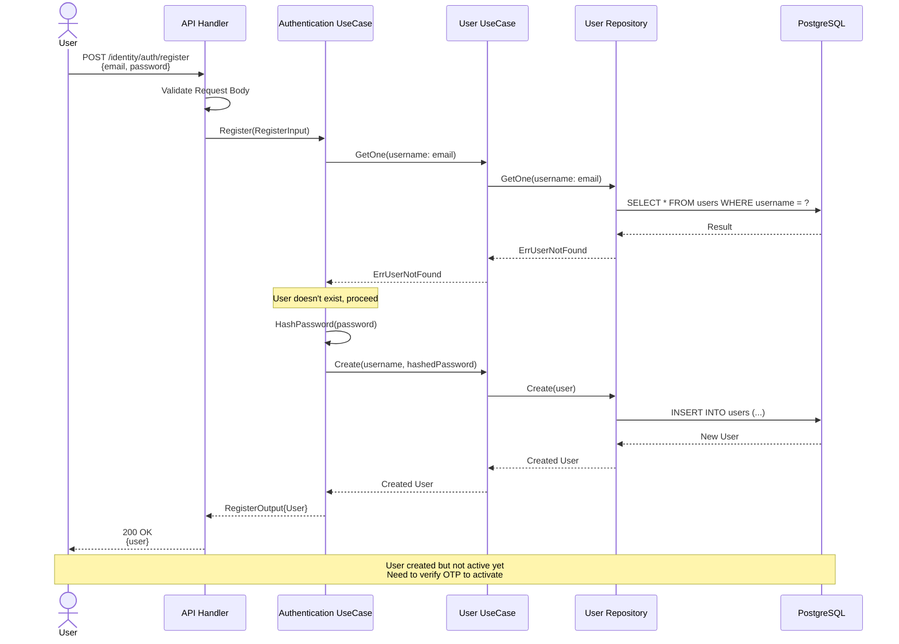
```mermaid
sequenceDiagram
    actor User
    participant API as API Handler
    participant AuthUC as Authentication UseCase
    participant UserUC as User UseCase
    participant UserRepo as User Repository
    participant DB as PostgreSQL

    User->>API: POST /identity/auth/register<br/>{email, password}
    API->>API: Validate Request Body
    API->>AuthUC: Register(RegisterInput)
    
    AuthUC->>UserUC: GetOne(username: email)
    UserUC->>UserRepo: GetOne(username: email)
    UserRepo->>DB: SELECT * FROM users WHERE username = ?
    DB-->>UserRepo: Result
    UserRepo-->>UserUC: ErrUserNotFound
    UserUC-->>AuthUC: ErrUserNotFound
    
    Note over AuthUC: User doesn't exist, proceed
    
    AuthUC->>AuthUC: HashPassword(password)
    AuthUC->>UserUC: Create(username, hashedPassword)
    UserUC->>UserRepo: Create(user)
    UserRepo->>DB: INSERT INTO users (...)
    DB-->>UserRepo: New User
    UserRepo-->>UserUC: Created User
    UserUC-->>AuthUC: Created User
    
    AuthUC-->>API: RegisterOutput{User}
    API-->>User: 200 OK<br/>{user}
    
    Note over User,DB: User created but not active yet<br/>Need to verify OTP to activate
```

**Key Points:**
- User is created with `is_active = false`
- Password is hashed using bcrypt
- No subscription is created yet (only after OTP verification)

---

### 2. Send OTP Flow

This flow sends an OTP (One-Time Password) to the user's email for verification.

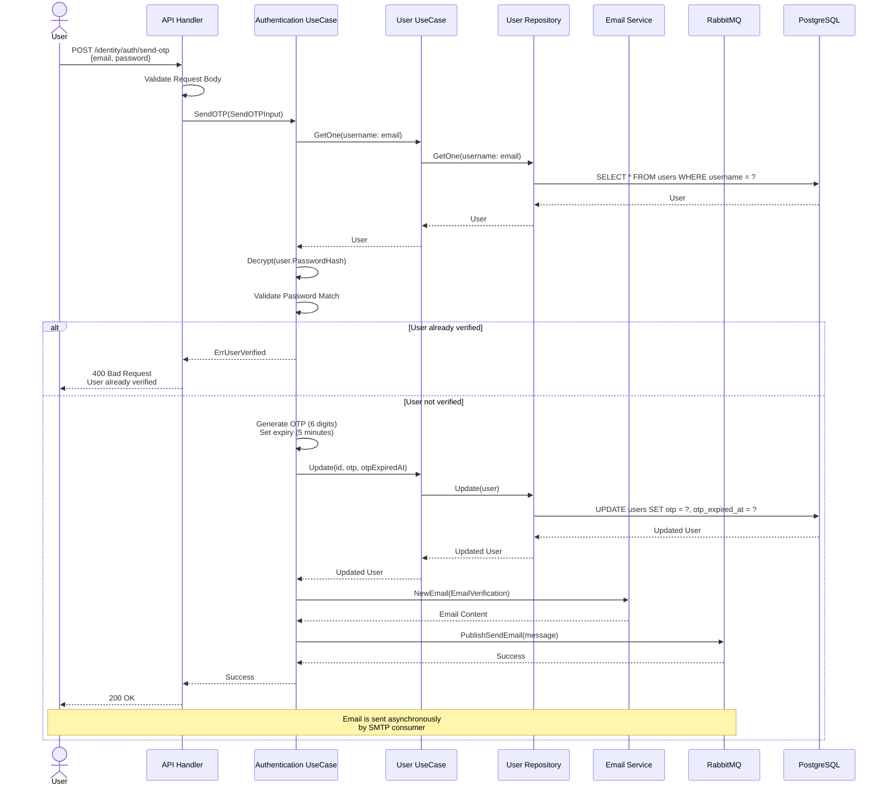
```mermaid
sequenceDiagram
    actor User
    participant API as API Handler
    participant AuthUC as Authentication UseCase
    participant UserUC as User UseCase
    participant UserRepo as User Repository
    participant Email as Email Service
    participant RabbitMQ as RabbitMQ
    participant DB as PostgreSQL

    User->>API: POST /identity/auth/send-otp<br/>{email, password}
    API->>API: Validate Request Body
    API->>AuthUC: SendOTP(SendOTPInput)
    
    AuthUC->>UserUC: GetOne(username: email)
    UserUC->>UserRepo: GetOne(username: email)
    UserRepo->>DB: SELECT * FROM users WHERE username = ?
    DB-->>UserRepo: User
    UserRepo-->>UserUC: User
    UserUC-->>AuthUC: User
    
    AuthUC->>AuthUC: Decrypt(user.PasswordHash)
    AuthUC->>AuthUC: Validate Password Match
    
    alt User already verified
        AuthUC-->>API: ErrUserVerified
        API-->>User: 400 Bad Request<br/>User already verified
    else User not verified
        AuthUC->>AuthUC: Generate OTP (6 digits)<br/>Set expiry (5 minutes)
        
        AuthUC->>UserUC: Update(id, otp, otpExpiredAt)
        UserUC->>UserRepo: Update(user)
        UserRepo->>DB: UPDATE users SET otp = ?, otp_expired_at = ?
        DB-->>UserRepo: Updated User
        UserRepo-->>UserUC: Updated User
        UserUC-->>AuthUC: Updated User
        
        AuthUC->>Email: NewEmail(EmailVerification)
        Email-->>AuthUC: Email Content
        
        AuthUC->>RabbitMQ: PublishSendEmail(message)
        RabbitMQ-->>AuthUC: Success
        
        AuthUC-->>API: Success
        API-->>User: 200 OK
        
        Note over RabbitMQ,User: Email is sent asynchronously<br/>by SMTP consumer
    end
```

**Key Points:**
- OTP is generated with 6 digits and expires in 5 minutes
- Password must match to send OTP
- Email is sent asynchronously via RabbitMQ
- OTP can only be sent to unverified users

---

### 3. Verify OTP Flow

This flow verifies the OTP and activates the user account. It also creates a free trial subscription.

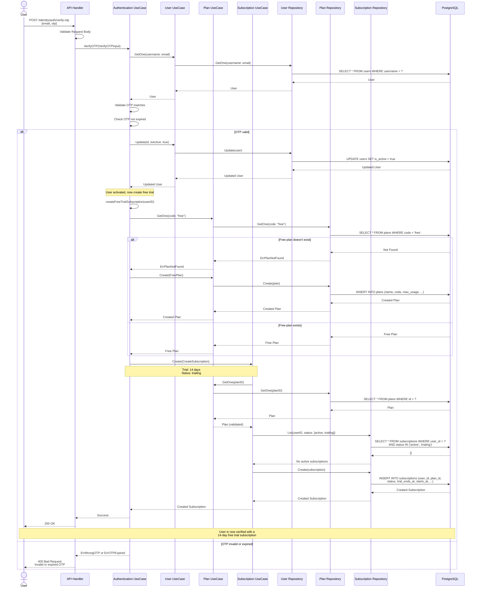
```mermaid
sequenceDiagram
    actor User
    participant API as API Handler
    participant AuthUC as Authentication UseCase
    participant UserUC as User UseCase
    participant PlanUC as Plan UseCase
    participant SubUC as Subscription UseCase
    participant UserRepo as User Repository
    participant PlanRepo as Plan Repository
    participant SubRepo as Subscription Repository
    participant DB as PostgreSQL

    User->>API: POST /identity/auth/verify-otp<br/>{email, otp}
    API->>API: Validate Request Body
    API->>AuthUC: VerifyOTP(VerifyOTPInput)
    
    AuthUC->>UserUC: GetOne(username: email)
    UserUC->>UserRepo: GetOne(username: email)
    UserRepo->>DB: SELECT * FROM users WHERE username = ?
    DB-->>UserRepo: User
    UserRepo-->>UserUC: User
    UserUC-->>AuthUC: User
    
    AuthUC->>AuthUC: Validate OTP matches
    AuthUC->>AuthUC: Check OTP not expired
    
    alt OTP valid
        AuthUC->>UserUC: Update(id, isActive: true)
        UserUC->>UserRepo: Update(user)
        UserRepo->>DB: UPDATE users SET is_active = true
        DB-->>UserRepo: Updated User
        UserRepo-->>UserUC: Updated User
        UserUC-->>AuthUC: Updated User
        
        Note over AuthUC: User activated, now create free trial
        
        AuthUC->>AuthUC: createFreeTrialSubscription(userID)
        
        AuthUC->>PlanUC: GetOne(code: "free")
        PlanUC->>PlanRepo: GetOne(code: "free")
        PlanRepo->>DB: SELECT * FROM plans WHERE code = 'free'
        
        alt Free plan doesn't exist
            DB-->>PlanRepo: Not Found
            PlanRepo-->>PlanUC: ErrPlanNotFound
            PlanUC-->>AuthUC: ErrPlanNotFound
            
            AuthUC->>PlanUC: Create(FreePlan)
            PlanUC->>PlanRepo: Create(plan)
            PlanRepo->>DB: INSERT INTO plans (name, code, max_usage, ...)
            DB-->>PlanRepo: Created Plan
            PlanRepo-->>PlanUC: Created Plan
            PlanUC-->>AuthUC: Created Plan
        else Free plan exists
            DB-->>PlanRepo: Free Plan
            PlanRepo-->>PlanUC: Free Plan
            PlanUC-->>AuthUC: Free Plan
        end
        
        AuthUC->>SubUC: Create(CreateSubscription)
        Note over AuthUC,SubUC: Trial: 14 days<br/>Status: trialing
        
        SubUC->>PlanUC: GetOne(planID)
        PlanUC->>PlanRepo: GetOne(planID)
        PlanRepo->>DB: SELECT * FROM plans WHERE id = ?
        DB-->>PlanRepo: Plan
        PlanRepo-->>PlanUC: Plan
        PlanUC-->>SubUC: Plan (validated)
        
        SubUC->>SubRepo: List(userID, status: [active, trialing])
        SubRepo->>DB: SELECT * FROM subscriptions WHERE user_id = ?<br/>AND status IN ('active', 'trialing')
        DB-->>SubRepo: []
        SubRepo-->>SubUC: No active subscriptions
        
        SubUC->>SubRepo: Create(subscription)
        SubRepo->>DB: INSERT INTO subscriptions (user_id, plan_id,<br/>status, trial_ends_at, starts_at, ...)
        DB-->>SubRepo: Created Subscription
        SubRepo-->>SubUC: Created Subscription
        SubUC-->>AuthUC: Created Subscription
        
        AuthUC-->>API: Success
        API-->>User: 200 OK
        
        Note over User,DB: User is now verified with a<br/>14-day free trial subscription
    else OTP invalid or expired
        AuthUC-->>API: ErrWrongOTP or ErrOTPExpired
        API-->>User: 400 Bad Request<br/>Invalid or expired OTP
    end
```

**Key Points:**
- OTP must be valid and not expired
- User account is activated (`is_active = true`)
- Free plan is created if it doesn't exist (code: "free", max_usage: 100)
- Trial subscription is created with 14 days duration
- If subscription creation fails, user is still activated

---

### 4. Login Flow

This flow authenticates the user and returns an access token.

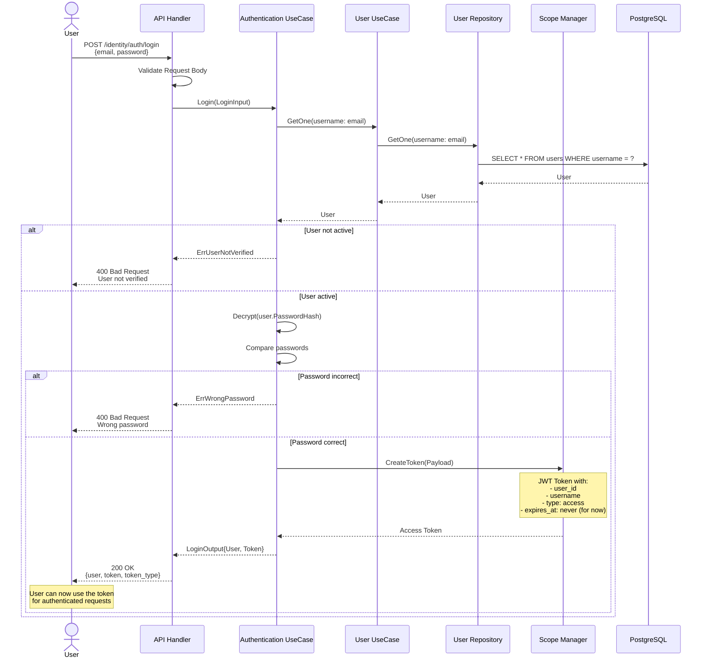
```mermaid
sequenceDiagram
    actor User
    participant API as API Handler
    participant AuthUC as Authentication UseCase
    participant UserUC as User UseCase
    participant UserRepo as User Repository
    participant Scope as Scope Manager
    participant DB as PostgreSQL

    User->>API: POST /identity/auth/login<br/>{email, password}
    API->>API: Validate Request Body
    API->>AuthUC: Login(LoginInput)
    
    AuthUC->>UserUC: GetOne(username: email)
    UserUC->>UserRepo: GetOne(username: email)
    UserRepo->>DB: SELECT * FROM users WHERE username = ?
    DB-->>UserRepo: User
    UserRepo-->>UserUC: User
    UserUC-->>AuthUC: User
    
    alt User not active
        AuthUC-->>API: ErrUserNotVerified
        API-->>User: 400 Bad Request<br/>User not verified
    else User active
        AuthUC->>AuthUC: Decrypt(user.PasswordHash)
        AuthUC->>AuthUC: Compare passwords
        
        alt Password incorrect
            AuthUC-->>API: ErrWrongPassword
            API-->>User: 400 Bad Request<br/>Wrong password
        else Password correct
            AuthUC->>Scope: CreateToken(Payload)
            Note over Scope: JWT Token with:<br/>- user_id<br/>- username<br/>- type: access<br/>- expires_at: never (for now)
            Scope-->>AuthUC: Access Token
            
            AuthUC-->>API: LoginOutput{User, Token}
            API-->>User: 200 OK<br/>{user, token, token_type}
            
            Note over User: User can now use the token<br/>for authenticated requests
        end
    end
```

**Key Points:**
- User must be verified (`is_active = true`) to login
- Password is validated against the stored hash
- JWT token is generated with user information
- Token currently doesn't expire (expires_at: 0)

---

## Plan Management Flows

### 5. Create Plan Flow

This flow creates a new subscription plan. Requires authentication.

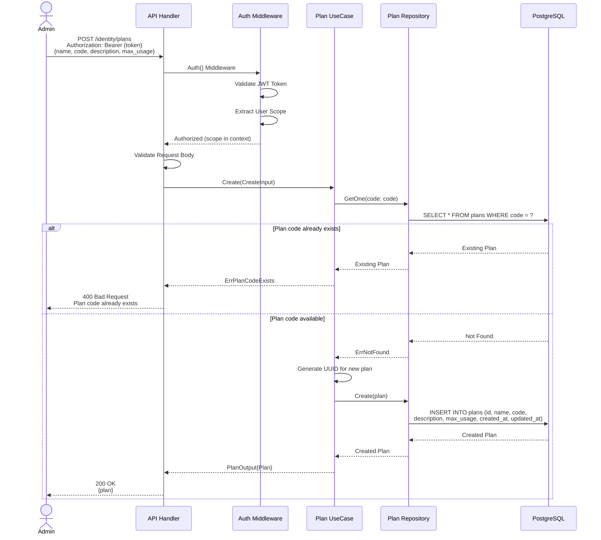
```mermaid
sequenceDiagram
    actor Admin
    participant API as API Handler
    participant MW as Auth Middleware
    participant PlanUC as Plan UseCase
    participant PlanRepo as Plan Repository
    participant DB as PostgreSQL

    Admin->>API: POST /identity/plans<br/>Authorization: Bearer {token}<br/>{name, code, description, max_usage}
    API->>MW: Auth() Middleware
    MW->>MW: Validate JWT Token
    MW->>MW: Extract User Scope
    MW-->>API: Authorized (scope in context)
    
    API->>API: Validate Request Body
    API->>PlanUC: Create(CreateInput)
    
    PlanUC->>PlanRepo: GetOne(code: code)
    PlanRepo->>DB: SELECT * FROM plans WHERE code = ?
    
    alt Plan code already exists
        DB-->>PlanRepo: Existing Plan
        PlanRepo-->>PlanUC: Existing Plan
        PlanUC-->>API: ErrPlanCodeExists
        API-->>Admin: 400 Bad Request<br/>Plan code already exists
    else Plan code available
        DB-->>PlanRepo: Not Found
        PlanRepo-->>PlanUC: ErrNotFound
        
        PlanUC->>PlanUC: Generate UUID for new plan
        PlanUC->>PlanRepo: Create(plan)
        PlanRepo->>DB: INSERT INTO plans (id, name, code,<br/>description, max_usage, created_at, updated_at)
        DB-->>PlanRepo: Created Plan
        PlanRepo-->>PlanUC: Created Plan
        PlanUC-->>API: PlanOutput{Plan}
        API-->>Admin: 200 OK<br/>{plan}
    end
```

**Key Points:**
- Authentication required
- Plan code must be unique
- `max_usage` defines API call limit
- Plan is not deleted permanently, uses soft delete

---

### 6. Get Plans Flow

This flow retrieves a list of plans with optional pagination and filtering.

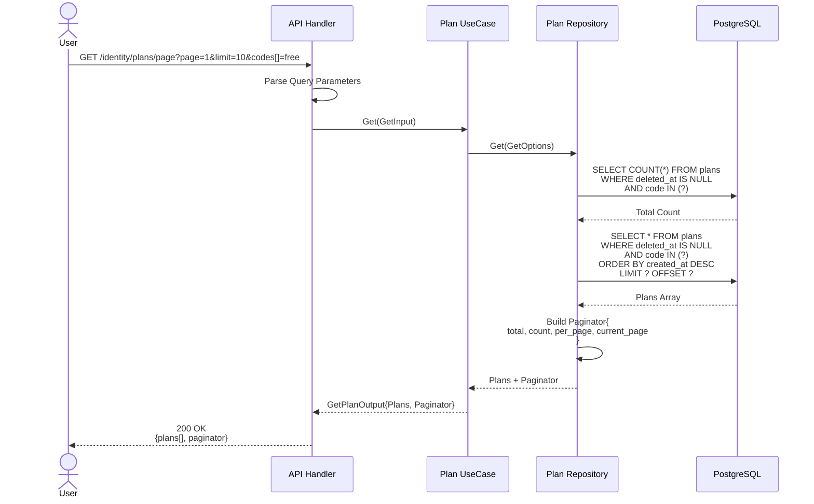
```mermaid
sequenceDiagram
    actor User
    participant API as API Handler
    participant PlanUC as Plan UseCase
    participant PlanRepo as Plan Repository
    participant DB as PostgreSQL

    User->>API: GET /identity/plans/page?page=1&limit=10&codes[]=free
    API->>API: Parse Query Parameters
    API->>PlanUC: Get(GetInput)
    
    PlanUC->>PlanRepo: Get(GetOptions)
    PlanRepo->>DB: SELECT COUNT(*) FROM plans<br/>WHERE deleted_at IS NULL<br/>AND code IN (?)
    DB-->>PlanRepo: Total Count
    
    PlanRepo->>DB: SELECT * FROM plans<br/>WHERE deleted_at IS NULL<br/>AND code IN (?)<br/>ORDER BY created_at DESC<br/>LIMIT ? OFFSET ?
    DB-->>PlanRepo: Plans Array
    
    PlanRepo->>PlanRepo: Build Paginator{<br/>  total, count, per_page, current_page<br/>}
    PlanRepo-->>PlanUC: Plans + Paginator
    PlanUC-->>API: GetPlanOutput{Plans, Paginator}
    API-->>User: 200 OK<br/>{plans[], paginator}
```

**Alternative Flow (List without pagination):**
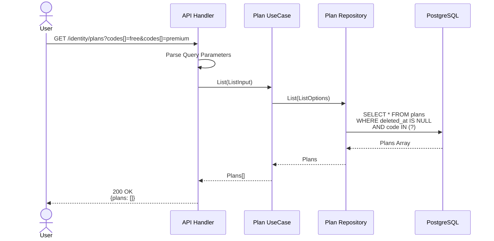
```mermaid
sequenceDiagram
    actor User
    participant API as API Handler
    participant PlanUC as Plan UseCase
    participant PlanRepo as Plan Repository
    participant DB as PostgreSQL

    User->>API: GET /identity/plans?codes[]=free&codes[]=premium
    API->>API: Parse Query Parameters
    API->>PlanUC: List(ListInput)
    
    PlanUC->>PlanRepo: List(ListOptions)
    PlanRepo->>DB: SELECT * FROM plans<br/>WHERE deleted_at IS NULL<br/>AND code IN (?)
    DB-->>PlanRepo: Plans Array
    PlanRepo-->>PlanUC: Plans
    PlanUC-->>API: Plans[]
    API-->>User: 200 OK<br/>{plans: []}
```

**Key Points:**
- No authentication required for listing plans
- Supports filtering by IDs and codes
- Pagination with adjustable page size
- Only returns non-deleted plans

---

### 7. Update Plan Flow

This flow updates an existing plan. Requires authentication.

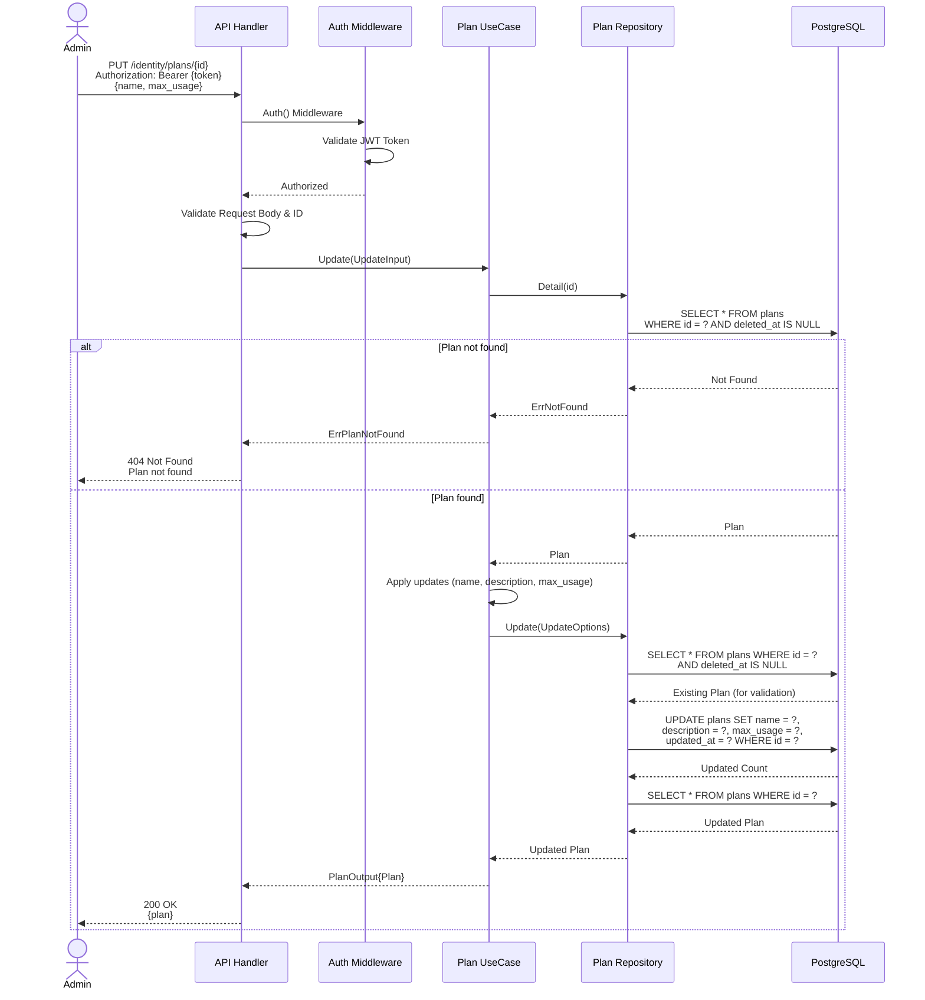
```mermaid
sequenceDiagram
    actor Admin
    participant API as API Handler
    participant MW as Auth Middleware
    participant PlanUC as Plan UseCase
    participant PlanRepo as Plan Repository
    participant DB as PostgreSQL

    Admin->>API: PUT /identity/plans/{id}<br/>Authorization: Bearer {token}<br/>{name, max_usage}
    API->>MW: Auth() Middleware
    MW->>MW: Validate JWT Token
    MW-->>API: Authorized
    
    API->>API: Validate Request Body & ID
    API->>PlanUC: Update(UpdateInput)
    
    PlanUC->>PlanRepo: Detail(id)
    PlanRepo->>DB: SELECT * FROM plans<br/>WHERE id = ? AND deleted_at IS NULL
    
    alt Plan not found
        DB-->>PlanRepo: Not Found
        PlanRepo-->>PlanUC: ErrNotFound
        PlanUC-->>API: ErrPlanNotFound
        API-->>Admin: 404 Not Found<br/>Plan not found
    else Plan found
        DB-->>PlanRepo: Plan
        PlanRepo-->>PlanUC: Plan
        
        PlanUC->>PlanUC: Apply updates (name, description, max_usage)
        PlanUC->>PlanRepo: Update(UpdateOptions)
        PlanRepo->>DB: SELECT * FROM plans WHERE id = ?<br/>AND deleted_at IS NULL
        DB-->>PlanRepo: Existing Plan (for validation)
        
        PlanRepo->>DB: UPDATE plans SET name = ?,<br/>description = ?, max_usage = ?,<br/>updated_at = ? WHERE id = ?
        DB-->>PlanRepo: Updated Count
        
        PlanRepo->>DB: SELECT * FROM plans WHERE id = ?
        DB-->>PlanRepo: Updated Plan
        PlanRepo-->>PlanUC: Updated Plan
        PlanUC-->>API: PlanOutput{Plan}
        API-->>Admin: 200 OK<br/>{plan}
    end
```

**Key Points:**
- Authentication required
- Only updates provided fields (partial update)
- Plan code cannot be updated (immutable)
- Returns the updated plan

---

## Subscription Management Flows

### 8. Create Subscription Flow

This flow creates a new subscription for a user. Requires authentication.

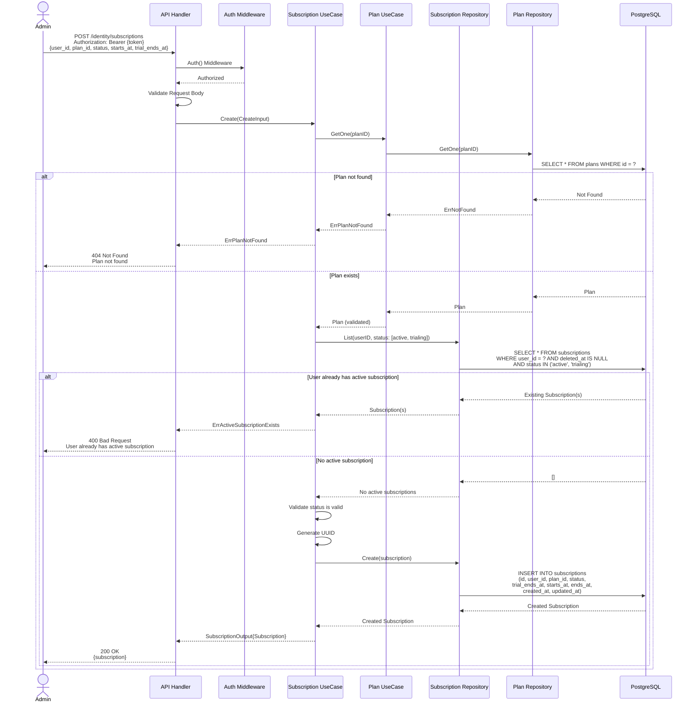
```mermaid
sequenceDiagram
    actor Admin
    participant API as API Handler
    participant MW as Auth Middleware
    participant SubUC as Subscription UseCase
    participant PlanUC as Plan UseCase
    participant SubRepo as Subscription Repository
    participant PlanRepo as Plan Repository
    participant DB as PostgreSQL

    Admin->>API: POST /identity/subscriptions<br/>Authorization: Bearer {token}<br/>{user_id, plan_id, status, starts_at, trial_ends_at}
    API->>MW: Auth() Middleware
    MW-->>API: Authorized
    
    API->>API: Validate Request Body
    API->>SubUC: Create(CreateInput)
    
    SubUC->>PlanUC: GetOne(planID)
    PlanUC->>PlanRepo: GetOne(planID)
    PlanRepo->>DB: SELECT * FROM plans WHERE id = ?
    
    alt Plan not found
        DB-->>PlanRepo: Not Found
        PlanRepo-->>PlanUC: ErrNotFound
        PlanUC-->>SubUC: ErrPlanNotFound
        SubUC-->>API: ErrPlanNotFound
        API-->>Admin: 404 Not Found<br/>Plan not found
    else Plan exists
        DB-->>PlanRepo: Plan
        PlanRepo-->>PlanUC: Plan
        PlanUC-->>SubUC: Plan (validated)
        
        SubUC->>SubRepo: List(userID, status: [active, trialing])
        SubRepo->>DB: SELECT * FROM subscriptions<br/>WHERE user_id = ? AND deleted_at IS NULL<br/>AND status IN ('active', 'trialing')
        
        alt User already has active subscription
            DB-->>SubRepo: Existing Subscription(s)
            SubRepo-->>SubUC: Subscription(s)
            SubUC-->>API: ErrActiveSubscriptionExists
            API-->>Admin: 400 Bad Request<br/>User already has active subscription
        else No active subscription
            DB-->>SubRepo: []
            SubRepo-->>SubUC: No active subscriptions
            
            SubUC->>SubUC: Validate status is valid
            SubUC->>SubUC: Generate UUID
            SubUC->>SubRepo: Create(subscription)
            SubRepo->>DB: INSERT INTO subscriptions<br/>(id, user_id, plan_id, status,<br/>trial_ends_at, starts_at, ends_at,<br/>created_at, updated_at)
            DB-->>SubRepo: Created Subscription
            SubRepo-->>SubUC: Created Subscription
            SubUC-->>API: SubscriptionOutput{Subscription}
            API-->>Admin: 200 OK<br/>{subscription}
        end
    end
```

**Key Points:**
- Authentication required
- Plan must exist
- User can only have one active/trialing subscription at a time
- Subscription status must be valid
- Supports trial subscriptions with `trial_ends_at`

---

### 9. Get My Active Subscription Flow

This flow retrieves the current user's active subscription.

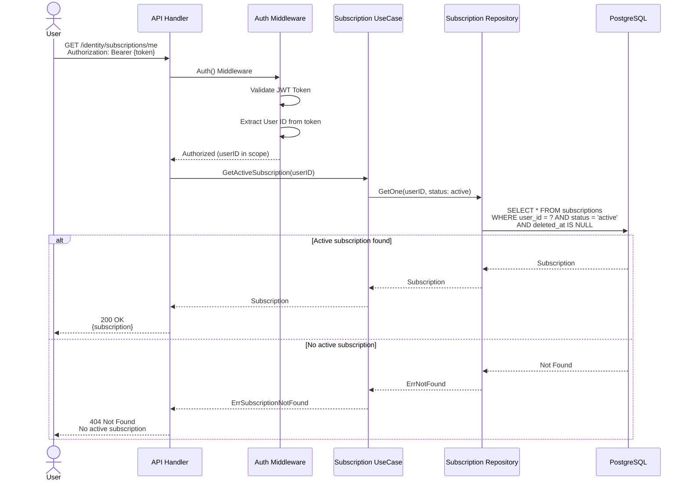
```mermaid
sequenceDiagram
    actor User
    participant API as API Handler
    participant MW as Auth Middleware
    participant SubUC as Subscription UseCase
    participant SubRepo as Subscription Repository
    participant DB as PostgreSQL

    User->>API: GET /identity/subscriptions/me<br/>Authorization: Bearer {token}
    API->>MW: Auth() Middleware
    MW->>MW: Validate JWT Token
    MW->>MW: Extract User ID from token
    MW-->>API: Authorized (userID in scope)
    
    API->>SubUC: GetActiveSubscription(userID)
    
    SubUC->>SubRepo: GetOne(userID, status: active)
    SubRepo->>DB: SELECT * FROM subscriptions<br/>WHERE user_id = ? AND status = 'active'<br/>AND deleted_at IS NULL
    
    alt Active subscription found
        DB-->>SubRepo: Subscription
        SubRepo-->>SubUC: Subscription
        SubUC-->>API: Subscription
        API-->>User: 200 OK<br/>{subscription}
    else No active subscription
        DB-->>SubRepo: Not Found
        SubRepo-->>SubUC: ErrNotFound
        SubUC-->>API: ErrSubscriptionNotFound
        API-->>User: 404 Not Found<br/>No active subscription
    end
```

**Key Points:**
- Authentication required
- Returns only active subscription (not trialing or expired)
- User can only see their own subscription
- Common use case: Check user's current plan and usage limits

---

### 10. Cancel Subscription Flow

This flow cancels an active or trialing subscription.

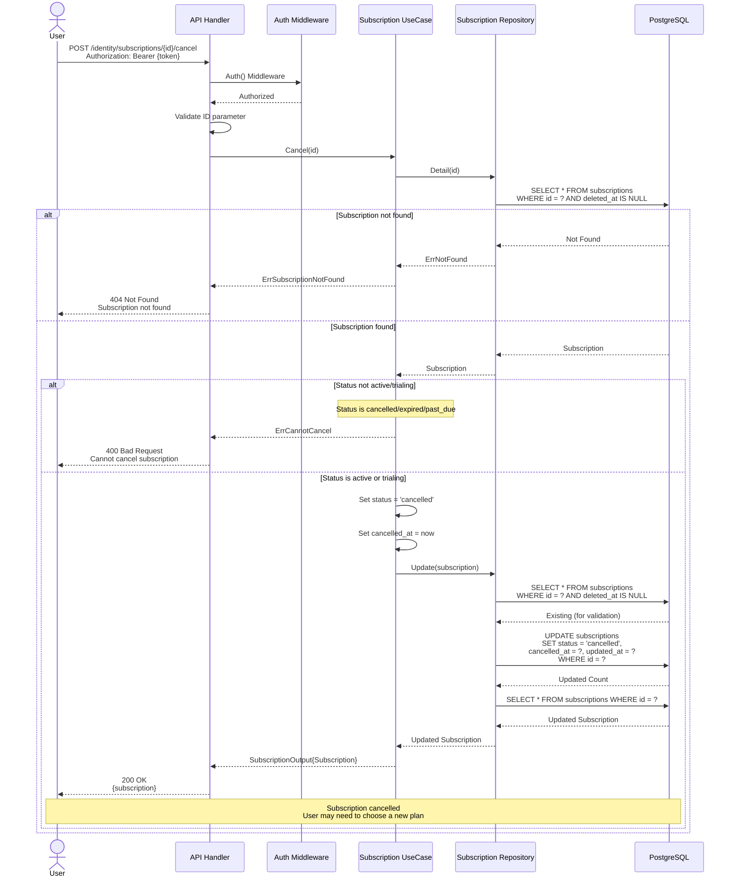
```mermaid
sequenceDiagram
    actor User
    participant API as API Handler
    participant MW as Auth Middleware
    participant SubUC as Subscription UseCase
    participant SubRepo as Subscription Repository
    participant DB as PostgreSQL

    User->>API: POST /identity/subscriptions/{id}/cancel<br/>Authorization: Bearer {token}
    API->>MW: Auth() Middleware
    MW-->>API: Authorized
    
    API->>API: Validate ID parameter
    API->>SubUC: Cancel(id)
    
    SubUC->>SubRepo: Detail(id)
    SubRepo->>DB: SELECT * FROM subscriptions<br/>WHERE id = ? AND deleted_at IS NULL
    
    alt Subscription not found
        DB-->>SubRepo: Not Found
        SubRepo-->>SubUC: ErrNotFound
        SubUC-->>API: ErrSubscriptionNotFound
        API-->>User: 404 Not Found<br/>Subscription not found
    else Subscription found
        DB-->>SubRepo: Subscription
        SubRepo-->>SubUC: Subscription
        
        alt Status not active/trialing
            Note over SubUC: Status is cancelled/expired/past_due
            SubUC-->>API: ErrCannotCancel
            API-->>User: 400 Bad Request<br/>Cannot cancel subscription
        else Status is active or trialing
            SubUC->>SubUC: Set status = 'cancelled'
            SubUC->>SubUC: Set cancelled_at = now
            
            SubUC->>SubRepo: Update(subscription)
            SubRepo->>DB: SELECT * FROM subscriptions<br/>WHERE id = ? AND deleted_at IS NULL
            DB-->>SubRepo: Existing (for validation)
            
            SubRepo->>DB: UPDATE subscriptions<br/>SET status = 'cancelled',<br/>cancelled_at = ?, updated_at = ?<br/>WHERE id = ?
            DB-->>SubRepo: Updated Count
            
            SubRepo->>DB: SELECT * FROM subscriptions WHERE id = ?
            DB-->>SubRepo: Updated Subscription
            SubRepo-->>SubUC: Updated Subscription
            SubUC-->>API: SubscriptionOutput{Subscription}
            API-->>User: 200 OK<br/>{subscription}
            
            Note over User,DB: Subscription cancelled<br/>User may need to choose a new plan
        end
    end
```

**Key Points:**
- Authentication required
- Only active or trialing subscriptions can be cancelled
- Sets `cancelled_at` timestamp
- Status changes to `cancelled`
- Cannot cancel already cancelled, expired, or past_due subscriptions

---

### 11. List User's Subscriptions Flow

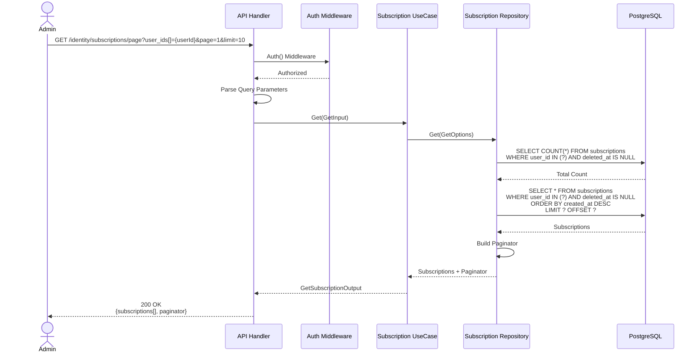
```mermaid
sequenceDiagram
    actor Admin
    participant API as API Handler
    participant MW as Auth Middleware
    participant SubUC as Subscription UseCase
    participant SubRepo as Subscription Repository
    participant DB as PostgreSQL

    Admin->>API: GET /identity/subscriptions/page?user_ids[]={userId}&page=1&limit=10
    API->>MW: Auth() Middleware
    MW-->>API: Authorized
    
    API->>API: Parse Query Parameters
    API->>SubUC: Get(GetInput)
    
    SubUC->>SubRepo: Get(GetOptions)
    SubRepo->>DB: SELECT COUNT(*) FROM subscriptions<br/>WHERE user_id IN (?) AND deleted_at IS NULL
    DB-->>SubRepo: Total Count
    
    SubRepo->>DB: SELECT * FROM subscriptions<br/>WHERE user_id IN (?) AND deleted_at IS NULL<br/>ORDER BY created_at DESC<br/>LIMIT ? OFFSET ?
    DB-->>SubRepo: Subscriptions
    
    SubRepo->>SubRepo: Build Paginator
    SubRepo-->>SubUC: Subscriptions + Paginator
    SubUC-->>API: GetSubscriptionOutput
    API-->>Admin: 200 OK<br/>{subscriptions[], paginator}
```

**Key Points:**
- Authentication required
- Admin can list subscriptions for specific users
- Supports pagination
- Returns subscription history with status

---

## User Management Flows

### 12. Get My Profile Flow

This flow retrieves the current authenticated user's profile information.

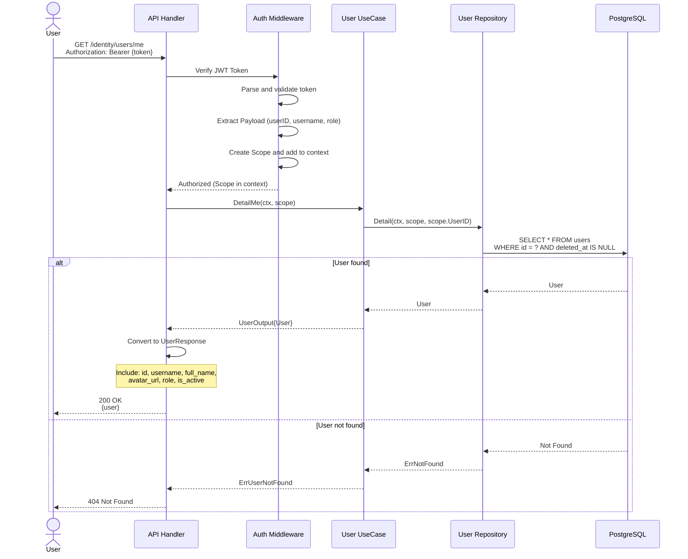
```mermaid
sequenceDiagram
    actor User
    participant API as API Handler
    participant AuthMW as Auth Middleware
    participant UserUC as User UseCase
    participant UserRepo as User Repository
    participant DB as PostgreSQL

    User->>API: GET /identity/users/me<br/>Authorization: Bearer {token}
    
    API->>AuthMW: Verify JWT Token
    AuthMW->>AuthMW: Parse and validate token
    AuthMW->>AuthMW: Extract Payload (userID, username, role)
    AuthMW->>AuthMW: Create Scope and add to context
    AuthMW-->>API: Authorized (Scope in context)
    
    API->>UserUC: DetailMe(ctx, scope)
    
    UserUC->>UserRepo: Detail(ctx, scope, scope.UserID)
    UserRepo->>DB: SELECT * FROM users<br/>WHERE id = ? AND deleted_at IS NULL
    
    alt User found
        DB-->>UserRepo: User
        UserRepo-->>UserUC: User
        
        UserUC-->>API: UserOutput{User}
        
        API->>API: Convert to UserResponse
        Note over API: Include: id, username, full_name,<br/>avatar_url, role, is_active
        
        API-->>User: 200 OK<br/>{user}
    else User not found
        DB-->>UserRepo: Not Found
        UserRepo-->>UserUC: ErrNotFound
        UserUC-->>API: ErrUserNotFound
        API-->>User: 404 Not Found
    end
```

**Key Points:**
- User can only view their own profile
- Role is decrypted from `role_hash` before response
- Password hash is never returned to client
- Requires valid JWT authentication

---

### 13. Update My Profile Flow

This flow updates the authenticated user's profile information (full name and avatar).

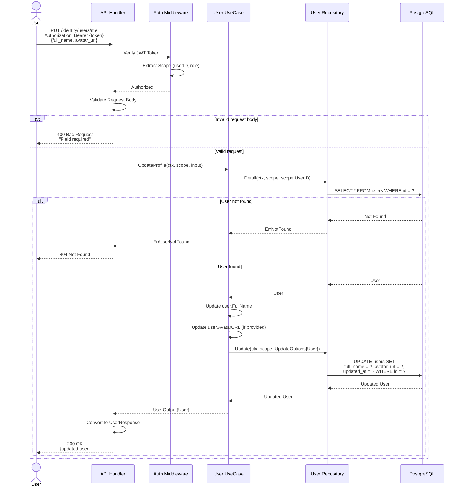
```mermaid
sequenceDiagram
    actor User
    participant API as API Handler
    participant AuthMW as Auth Middleware
    participant UserUC as User UseCase
    participant UserRepo as User Repository
    participant DB as PostgreSQL

    User->>API: PUT /identity/users/me<br/>Authorization: Bearer {token}<br/>{full_name, avatar_url}
    
    API->>AuthMW: Verify JWT Token
    AuthMW->>AuthMW: Extract Scope (userID, role)
    AuthMW-->>API: Authorized
    
    API->>API: Validate Request Body
    
    alt Invalid request body
        API-->>User: 400 Bad Request<br/>"Field required"
    else Valid request
        API->>UserUC: UpdateProfile(ctx, scope, input)
        
        UserUC->>UserRepo: Detail(ctx, scope, scope.UserID)
        UserRepo->>DB: SELECT * FROM users WHERE id = ?
        
        alt User not found
            DB-->>UserRepo: Not Found
            UserRepo-->>UserUC: ErrNotFound
            UserUC-->>API: ErrUserNotFound
            API-->>User: 404 Not Found
        else User found
            DB-->>UserRepo: User
            UserRepo-->>UserUC: User
            
            UserUC->>UserUC: Update user.FullName
            UserUC->>UserUC: Update user.AvatarURL (if provided)
            
            UserUC->>UserRepo: Update(ctx, scope, UpdateOptions{User})
            UserRepo->>DB: UPDATE users SET<br/>full_name = ?, avatar_url = ?,<br/>updated_at = ? WHERE id = ?
            DB-->>UserRepo: Updated User
            UserRepo-->>UserUC: Updated User
            
            UserUC-->>API: UserOutput{User}
            API->>API: Convert to UserResponse
            API-->>User: 200 OK<br/>{updated user}
        end
    end
```

**Key Points:**
- User can only update their own profile
- Only `full_name` and `avatar_url` can be updated
- Username, role, and password cannot be changed via this endpoint
- `updated_at` timestamp is automatically set

---

### 14. Change Password Flow

This flow changes the authenticated user's password after verifying the old password.

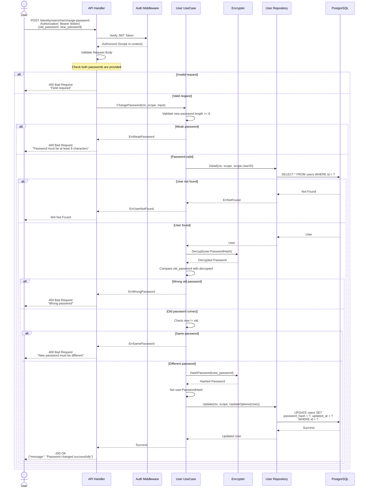
```mermaid
sequenceDiagram
    actor User
    participant API as API Handler
    participant AuthMW as Auth Middleware
    participant UserUC as User UseCase
    participant Encrypter as Encrypter
    participant UserRepo as User Repository
    participant DB as PostgreSQL

    User->>API: POST /identity/users/me/change-password<br/>Authorization: Bearer {token}<br/>{old_password, new_password}
    
    API->>AuthMW: Verify JWT Token
    AuthMW-->>API: Authorized (Scope in context)
    
    API->>API: Validate Request Body
    Note over API: Check both passwords are provided
    
    alt Invalid request
        API-->>User: 400 Bad Request<br/>"Field required"
    else Valid request
        API->>UserUC: ChangePassword(ctx, scope, input)
        
        UserUC->>UserUC: Validate new password length >= 8
        
        alt Weak password
            UserUC-->>API: ErrWeakPassword
            API-->>User: 400 Bad Request<br/>"Password must be at least 8 characters"
        else Password valid
            UserUC->>UserRepo: Detail(ctx, scope, scope.UserID)
            UserRepo->>DB: SELECT * FROM users WHERE id = ?
            
            alt User not found
                DB-->>UserRepo: Not Found
                UserRepo-->>UserUC: ErrNotFound
                UserUC-->>API: ErrUserNotFound
                API-->>User: 404 Not Found
            else User found
                DB-->>UserRepo: User
                UserRepo-->>UserUC: User
                
                UserUC->>Encrypter: Decrypt(user.PasswordHash)
                Encrypter-->>UserUC: Decrypted Password
                
                UserUC->>UserUC: Compare old_password with decrypted
                
                alt Wrong old password
                    UserUC-->>API: ErrWrongPassword
                    API-->>User: 400 Bad Request<br/>"Wrong password"
                else Old password correct
                    UserUC->>UserUC: Check new != old
                    
                    alt Same password
                        UserUC-->>API: ErrSamePassword
                        API-->>User: 400 Bad Request<br/>"New password must be different"
                    else Different password
                        UserUC->>Encrypter: HashPassword(new_password)
                        Encrypter-->>UserUC: Hashed Password
                        
                        UserUC->>UserUC: Set user.PasswordHash
                        
                        UserUC->>UserRepo: Update(ctx, scope, UpdateOptions{User})
                        UserRepo->>DB: UPDATE users SET<br/>password_hash = ?, updated_at = ?<br/>WHERE id = ?
                        DB-->>UserRepo: Success
                        UserRepo-->>UserUC: Updated User
                        
                        UserUC-->>API: Success
                        API-->>User: 200 OK<br/>{"message": "Password changed successfully"}
                    end
                end
            end
        end
    end
```

**Key Points:**
- Old password must be correct to change
- New password must be at least 8 characters
- New password must be different from old password
- Password is encrypted before storage using bcrypt
- User is not logged out (JWT token remains valid)

**Security Considerations:**
- Password validation on server side
- Encrypted storage prevents plaintext exposure
- All password operations are logged for audit

---

## Admin User Management Flows

### 15. Get User Detail (Admin) Flow

This flow retrieves detailed information about a specific user by ID. **Admin only.**

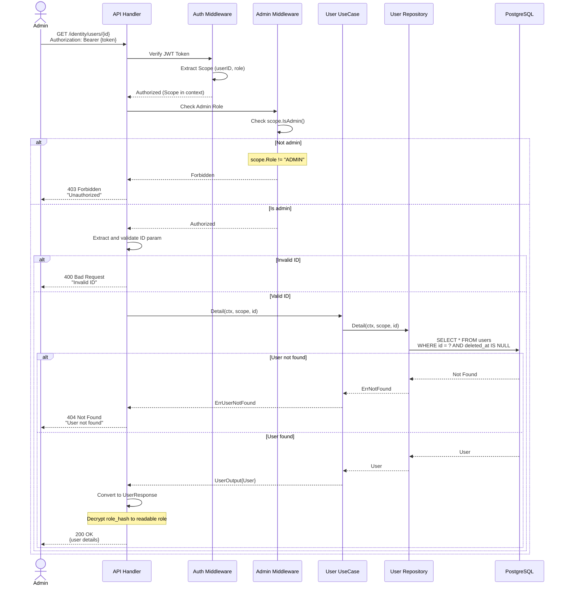
```mermaid
sequenceDiagram
    actor Admin
    participant API as API Handler
    participant AuthMW as Auth Middleware
    participant AdminMW as Admin Middleware
    participant UserUC as User UseCase
    participant UserRepo as User Repository
    participant DB as PostgreSQL

    Admin->>API: GET /identity/users/{id}<br/>Authorization: Bearer {token}
    
    API->>AuthMW: Verify JWT Token
    AuthMW->>AuthMW: Extract Scope (userID, role)
    AuthMW-->>API: Authorized (Scope in context)
    
    API->>AdminMW: Check Admin Role
    AdminMW->>AdminMW: Check scope.IsAdmin()
    
    alt Not admin
        Note over AdminMW: scope.Role != "ADMIN"
        AdminMW-->>API: Forbidden
        API-->>Admin: 403 Forbidden<br/>"Unauthorized"
    else Is admin
        AdminMW-->>API: Authorized
        
        API->>API: Extract and validate ID param
        
        alt Invalid ID
            API-->>Admin: 400 Bad Request<br/>"Invalid ID"
        else Valid ID
            API->>UserUC: Detail(ctx, scope, id)
            
            UserUC->>UserRepo: Detail(ctx, scope, id)
            UserRepo->>DB: SELECT * FROM users<br/>WHERE id = ? AND deleted_at IS NULL
            
            alt User not found
                DB-->>UserRepo: Not Found
                UserRepo-->>UserUC: ErrNotFound
                UserUC-->>API: ErrUserNotFound
                API-->>Admin: 404 Not Found<br/>"User not found"
            else User found
                DB-->>UserRepo: User
                UserRepo-->>UserUC: User
                
                UserUC-->>API: UserOutput{User}
                
                API->>API: Convert to UserResponse
                Note over API: Decrypt role_hash to readable role
                
                API-->>Admin: 200 OK<br/>{user details}
            end
        end
    end
```

**Key Points:**
- **Admin authentication required** via `AdminOnly()` middleware
- Admin can view any user's profile
- User's role is decrypted and included in response
- Password hash is never exposed

---

### 16. List Users (Admin) Flow

This flow lists all users without pagination. **Admin only.**

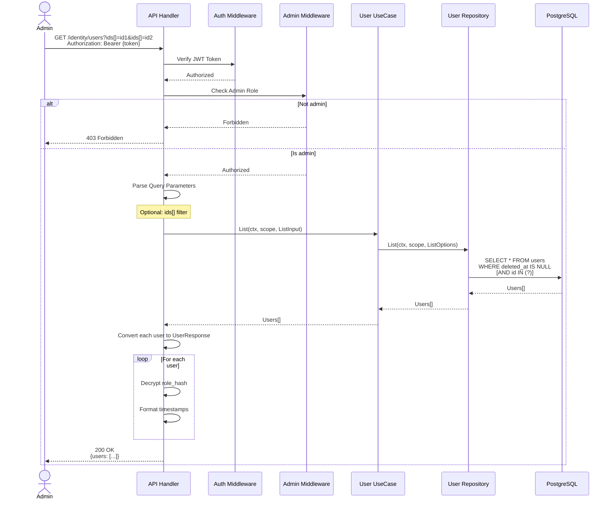
```mermaid
sequenceDiagram
    actor Admin
    participant API as API Handler
    participant AuthMW as Auth Middleware
    participant AdminMW as Admin Middleware
    participant UserUC as User UseCase
    participant UserRepo as User Repository
    participant DB as PostgreSQL

    Admin->>API: GET /identity/users?ids[]=id1&ids[]=id2<br/>Authorization: Bearer {token}
    
    API->>AuthMW: Verify JWT Token
    AuthMW-->>API: Authorized
    
    API->>AdminMW: Check Admin Role
    
    alt Not admin
        AdminMW-->>API: Forbidden
        API-->>Admin: 403 Forbidden
    else Is admin
        AdminMW-->>API: Authorized
        
        API->>API: Parse Query Parameters
        Note over API: Optional: ids[] filter
        
        API->>UserUC: List(ctx, scope, ListInput)
        
        UserUC->>UserRepo: List(ctx, scope, ListOptions)
        
        UserRepo->>DB: SELECT * FROM users<br/>WHERE deleted_at IS NULL<br/>[AND id IN (?)]
        
        DB-->>UserRepo: Users[]
        UserRepo-->>UserUC: Users[]
        
        UserUC-->>API: Users[]
        
        API->>API: Convert each user to UserResponse
        loop For each user
            API->>API: Decrypt role_hash
            API->>API: Format timestamps
        end
        
        API-->>Admin: 200 OK<br/>{users: [...]}
    end
```

**Key Points:**
- **Admin only** endpoint
- Returns all users (no pagination)
- Optional filtering by user IDs
- Useful for admin dashboards or bulk operations
- Role is decrypted for each user

---

### 17. Get Users with Pagination (Admin) Flow

This flow retrieves users with pagination support. **Admin only.**

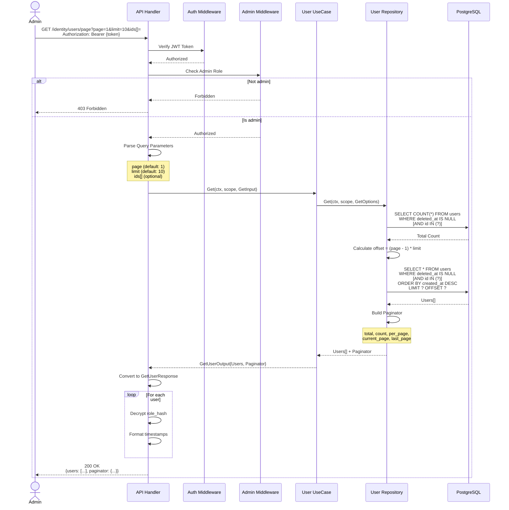
```mermaid
sequenceDiagram
    actor Admin
    participant API as API Handler
    participant AuthMW as Auth Middleware
    participant AdminMW as Admin Middleware
    participant UserUC as User UseCase
    participant UserRepo as User Repository
    participant DB as PostgreSQL

    Admin->>API: GET /identity/users/page?page=1&limit=10&ids[]=<br/>Authorization: Bearer {token}
    
    API->>AuthMW: Verify JWT Token
    AuthMW-->>API: Authorized
    
    API->>AdminMW: Check Admin Role
    
    alt Not admin
        AdminMW-->>API: Forbidden
        API-->>Admin: 403 Forbidden
    else Is admin
        AdminMW-->>API: Authorized
        
        API->>API: Parse Query Parameters
        Note over API: page (default: 1)<br/>limit (default: 10)<br/>ids[] (optional)
        
        API->>UserUC: Get(ctx, scope, GetInput)
        
        UserUC->>UserRepo: Get(ctx, scope, GetOptions)
        
        UserRepo->>DB: SELECT COUNT(*) FROM users<br/>WHERE deleted_at IS NULL<br/>[AND id IN (?)]
        DB-->>UserRepo: Total Count
        
        UserRepo->>UserRepo: Calculate offset = (page - 1) * limit
        
        UserRepo->>DB: SELECT * FROM users<br/>WHERE deleted_at IS NULL<br/>[AND id IN (?)]<br/>ORDER BY created_at DESC<br/>LIMIT ? OFFSET ?
        DB-->>UserRepo: Users[]
        
        UserRepo->>UserRepo: Build Paginator
        Note over UserRepo: total, count, per_page,<br/>current_page, last_page
        
        UserRepo-->>UserUC: Users[] + Paginator
        
        UserUC-->>API: GetUserOutput{Users, Paginator}
        
        API->>API: Convert to GetUserResponse
        loop For each user
            API->>API: Decrypt role_hash
            API->>API: Format timestamps
        end
        
        API-->>Admin: 200 OK<br/>{users: [...], paginator: {...}}
    end
```

**Response Format:**
```json
{
  "users": [
    {
      "id": "uuid",
      "username": "user@example.com",
      "full_name": "John Doe",
      "avatar_url": "https://...",
      "role": "USER",
      "is_active": true,
      "created_at": "2025-01-01T00:00:00Z",
      "updated_at": "2025-01-01T00:00:00Z"
    }
  ],
  "paginator": {
    "total": 100,
    "count": 10,
    "per_page": 10,
    "current_page": 1,
    "last_page": 10
  }
}
```

**Key Points:**
- **Admin only** endpoint
- Pagination parameters: `page`, `limit`
- Optional filtering by user IDs
- Returns paginator metadata for UI
- Efficient for large user lists

---

## Error Handling Patterns

All API flows follow consistent error handling:

### Common HTTP Status Codes

- **200 OK**: Successful operation
- **400 Bad Request**: 
  - Invalid request body
  - Validation errors
  - Business logic errors (e.g., user already exists, wrong password)
- **401 Unauthorized**: Missing or invalid authentication token
- **403 Forbidden**: Insufficient permissions (not admin)
- **404 Not Found**: Resource not found (user, plan, subscription)
- **500 Internal Server Error**: Unexpected server errors

### Error Response Format

```json
{
  "error": {
    "code": 110004,
    "message": "Username existed"
  }
}
```

### Error Code Ranges

- **110xxx**: Authentication errors
- **120xxx**: Plan errors
- **130xxx**: Subscription errors
- **140xxx**: User errors

---

## Summary

This API implements a complete subscription-based system with the following key features:

1. **User Authentication**: Registration, OTP verification, and login
2. **Automatic Free Trial**: 14-day trial subscription created on verification
3. **Plan Management**: CRUD operations for subscription plans
4. **Subscription Management**: Create, read, update, cancel subscriptions
5. **User Management**: Profile management and admin operations
6. **Access Control**: JWT-based authentication + Role-based authorization

### Flow Integration

The flows are integrated as follows:
1. User registers → Receives OTP
2. User verifies OTP → Account activated + Free trial subscription created
3. User logs in → Receives JWT token (with role)
4. User can view/update their profile and subscription
5. Admin can manage users, plans, and subscriptions

### Database Schema Dependencies

- **users** table: Stores user information (with encrypted role)
- **plans** table: Stores subscription plans
- **subscriptions** table: Links users to plans with status and dates
  - Foreign key: `user_id` → `users.id`
  - Foreign key: `plan_id` → `plans.id`

---

**Total Flows**: 17
- Authentication: 4 flows
- Plan Management: 3 flows
- Subscription Management: 4 flows
- User Management: 3 flows
- Admin User Management: 3 flows

---

*Last updated: November 20, 2025*
