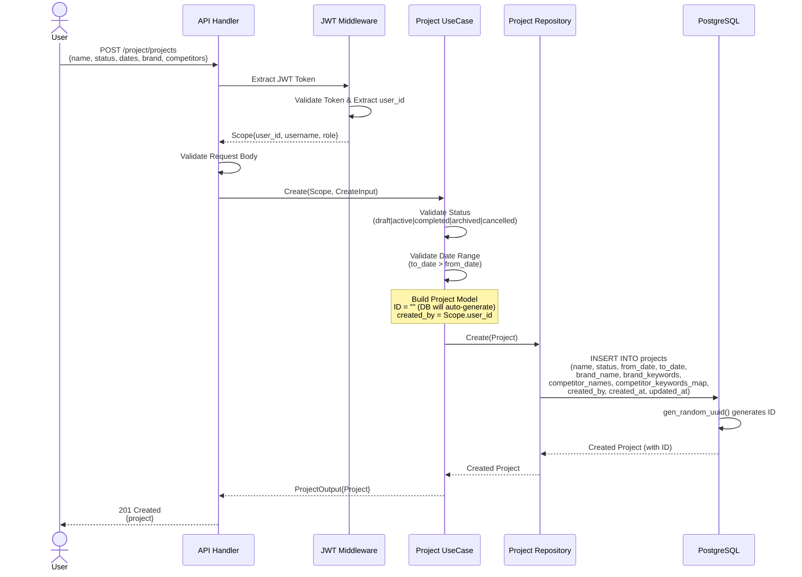
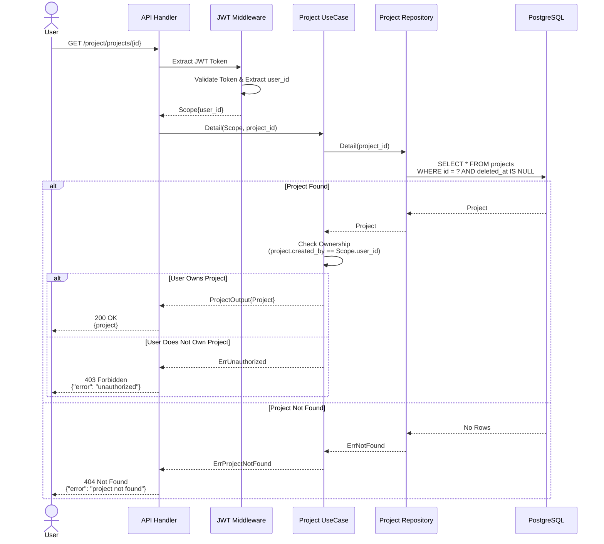
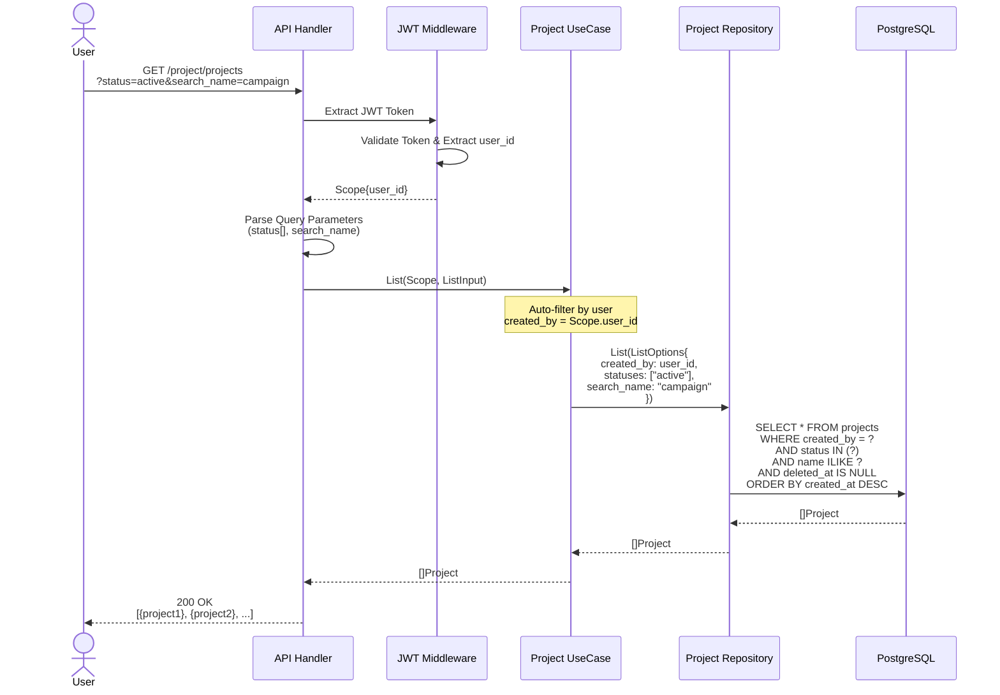
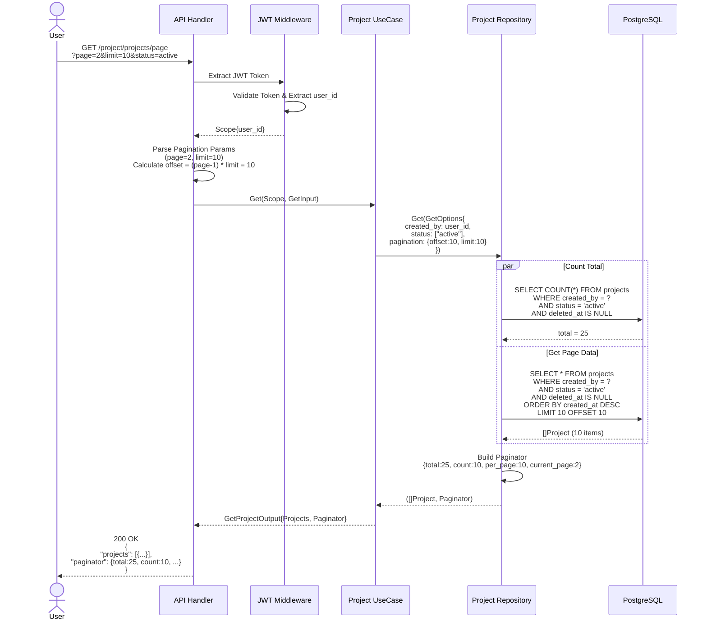
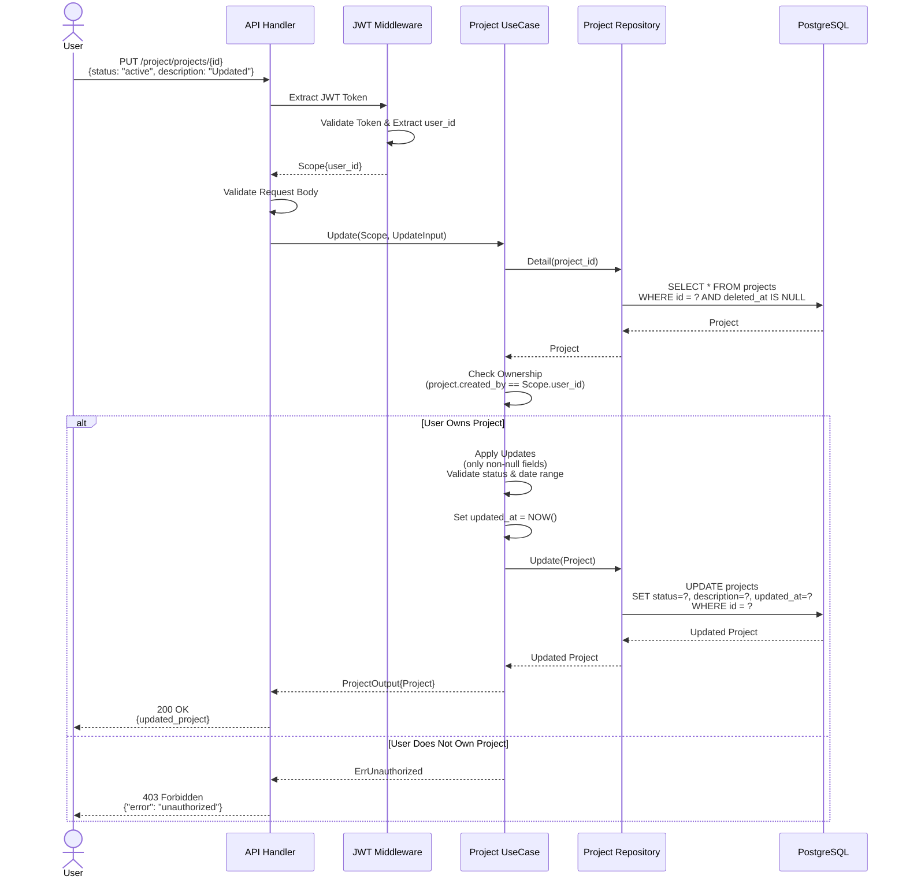
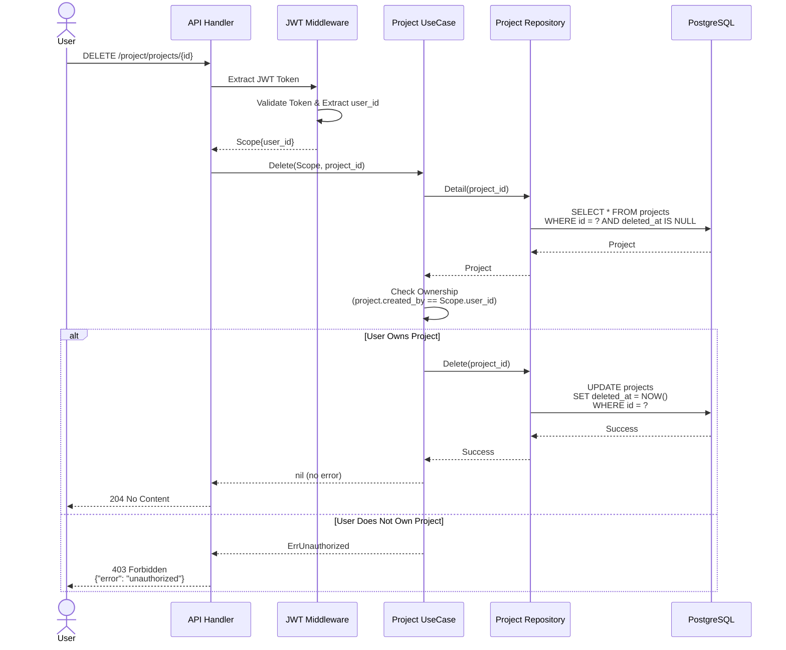

# SMAP Project API

Sequence diagrams for API flows in SMAP Project Service.

## Table of Contents
- [Project Management Flows](#project-management-flows)
  - [1. Create Project Flow](#1-create-project-flow)
  - [2. Get Project Detail Flow](#2-get-project-detail-flow)
  - [3. List Projects Flow](#3-list-projects-flow)
  - [4. Get Projects with Pagination Flow](#4-get-projects-with-pagination-flow)
  - [5. Update Project Flow](#5-update-project-flow)
  - [6. Delete Project Flow](#6-delete-project-flow)

---

## Project Management Flows

### 1. Create Project Flow

This flow handles project creation with brand and competitor tracking setup.



**Key Points:**
- JWT token required (user_id extracted for created_by)
- ID auto-generated by database (`gen_random_uuid()`)
- Date validation: `to_date` must be after `from_date`
- Status must be one of: draft, active, completed, archived, cancelled
- Competitor keywords stored as JSONB map

---

### 2. Get Project Detail Flow

This flow retrieves a single project by ID with ownership verification.



**Key Points:**
- Ownership verification (only creator can view)
- Soft delete check (deleted_at IS NULL)
- Returns 403 if user doesn't own the project

---

### 3. List Projects Flow

This flow lists all projects for the authenticated user (no pagination).



**Key Points:**
- Automatically filters by `created_by = user_id` (user isolation)
- Optional filters: status, search by name (case-insensitive)
- Returns all matching projects (no pagination limit)
- Ordered by `created_at DESC`

---

### 4. Get Projects with Pagination Flow

This flow retrieves projects with pagination support.



**Key Points:**
- Supports page and limit parameters
- Returns both data and pagination metadata
- Efficient: COUNT and SELECT run in parallel
- Default: page=1, limit=15 (configured in paginator)

---

### 5. Update Project Flow

This flow updates an existing project with ownership verification.



**Key Points:**
- Partial updates (only provided fields are updated)
- Ownership check before allowing update
- Date range validation if dates are updated
- Status validation if status is updated
- `updated_at` automatically set

---

### 6. Delete Project Flow

This flow soft-deletes a project (sets deleted_at timestamp).



**Key Points:**
- Soft delete (sets `deleted_at` timestamp)
- Data preserved for audit/recovery
- Ownership check before allowing delete
- Returns 204 No Content on success
- Deleted projects excluded from all queries

---

## Common Error Responses

### Authentication Errors
```json
// 401 Unauthorized - Missing or invalid JWT
{
  "error_code": 401,
  "message": "unauthorized"
}
```

### Authorization Errors
```json
// 403 Forbidden - User doesn't own the project
{
  "error_code": 403,
  "message": "unauthorized to access this project"
}
```

### Validation Errors
```json
// 400 Bad Request - Invalid input
{
  "error_code": 400,
  "message": "invalid date range: to_date must be after from_date"
}

{
  "error_code": 400,
  "message": "invalid project status"
}
```

### Not Found Errors
```json
// 404 Not Found
{
  "error_code": 404,
  "message": "project not found"
}
```

---

## Request/Response Examples

### Create Project Request
```json
POST /project/projects
Authorization: Bearer <JWT_TOKEN>
Content-Type: application/json

{
  "name": "Q1 2025 Campaign",
  "description": "First quarter brand monitoring",
  "status": "draft",
  "from_date": "2025-01-01T00:00:00Z",
  "to_date": "2025-03-31T23:59:59Z",
  "brand_name": "MyBrand",
  "brand_keywords": ["mybrand", "my brand", "brand"],
  "competitor_names": ["Competitor A", "Competitor B"],
  "competitor_keywords_map": {
    "Competitor A": ["competitor-a", "comp-a"],
    "Competitor B": ["competitor-b", "comp-b"]
  }
}
```

### Success Response
```json
HTTP/1.1 201 Created
Content-Type: application/json

{
  "error_code": 0,
  "message": "Success",
  "data": {
    "id": "550e8400-e29b-41d4-a716-446655440000",
    "name": "Q1 2025 Campaign",
    "description": "First quarter brand monitoring",
    "status": "draft",
    "from_date": "2025-01-01T00:00:00Z",
    "to_date": "2025-03-31T23:59:59Z",
    "brand_name": "MyBrand",
    "brand_keywords": ["mybrand", "my brand", "brand"],
    "competitor_names": ["Competitor A", "Competitor B"],
    "competitor_keywords_map": {
      "Competitor A": ["competitor-a", "comp-a"],
      "Competitor B": ["competitor-b", "comp-b"]
    },
    "created_by": "user-uuid-from-jwt",
    "created_at": "2025-11-21T14:30:00Z",
    "updated_at": "2025-11-21T14:30:00Z"
  }
}
```

---

**Last Updated**: November 21, 2025
**Document Version**: 1.0.0
**Maintained By**: SMAP Development Team
